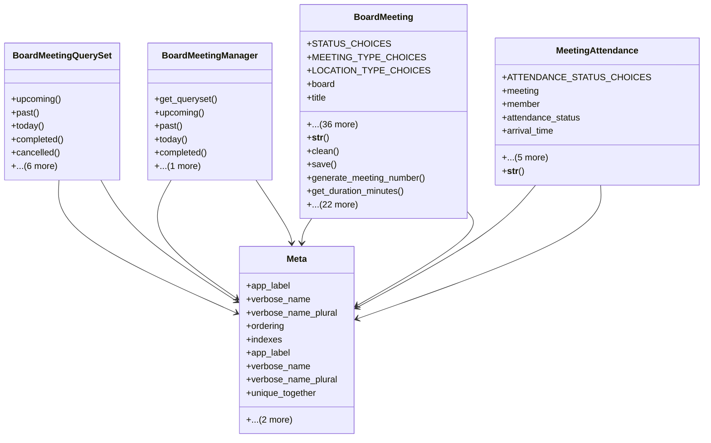

# services_modules.board_management.models.board_meeting

## Imports
- board
- board_member
- calendar
- datetime
- django.contrib.auth
- django.core.exceptions
- django.db
- django.db.models
- django.urls
- django.utils
- django.utils.translation

## Classes
- BoardMeetingQuerySet
  - method: `upcoming`
  - method: `past`
  - method: `today`
  - method: `completed`
  - method: `cancelled`
  - method: `in_progress`
  - method: `by_board`
  - method: `by_year`
  - method: `by_month`
  - method: `with_minutes`
  - method: `without_minutes`
- BoardMeetingManager
  - method: `get_queryset`
  - method: `upcoming`
  - method: `past`
  - method: `today`
  - method: `completed`
  - method: `create_recurring`
- BoardMeeting
  - attr: `STATUS_CHOICES`
  - attr: `MEETING_TYPE_CHOICES`
  - attr: `LOCATION_TYPE_CHOICES`
  - attr: `board`
  - attr: `title`
  - attr: `meeting_number`
  - attr: `meeting_type`
  - attr: `date`
  - attr: `start_time`
  - attr: `end_time`
  - attr: `actual_start_time`
  - attr: `actual_end_time`
  - attr: `location`
  - attr: `location_type`
  - attr: `virtual_meeting_link`
  - attr: `virtual_meeting_id`
  - attr: `virtual_meeting_password`
  - attr: `status`
  - attr: `agenda`
  - attr: `minutes`
  - attr: `quorum_required`
  - attr: `attendees`
  - attr: `external_attendees`
  - attr: `attachments`
  - attr: `send_reminder`
  - attr: `reminder_days_before`
  - attr: `reminder_sent`
  - attr: `is_recorded`
  - attr: `recording_url`
  - attr: `minutes_approved`
  - attr: `minutes_approved_date`
  - attr: `minutes_approved_by`
  - attr: `notes`
  - attr: `cancellation_reason`
  - attr: `postponement_reason`
  - attr: `new_date`
  - attr: `created_by`
  - attr: `updated_by`
  - attr: `created_at`
  - attr: `updated_at`
  - attr: `objects`
  - method: `__str__`
  - method: `clean`
  - method: `save`
  - method: `generate_meeting_number`
  - method: `get_duration_minutes`
  - method: `get_duration_display`
  - method: `is_completed`
  - method: `is_upcoming`
  - method: `is_today`
  - method: `is_past`
  - method: `is_quorum_met`
  - method: `get_attendees_count`
  - method: `get_present_count`
  - method: `get_absent_count`
  - method: `get_excused_count`
  - method: `get_attendance_rate`
  - method: `get_decisions_count`
  - method: `get_pending_decisions_count`
  - method: `can_start`
  - method: `can_complete`
  - method: `start_meeting`
  - method: `complete_meeting`
  - method: `cancel_meeting`
  - method: `postpone_meeting`
  - method: `send_reminder_notifications`
  - method: `get_absolute_url`
  - method: `get_statistics`
- MeetingAttendance
  - attr: `ATTENDANCE_STATUS_CHOICES`
  - attr: `meeting`
  - attr: `member`
  - attr: `attendance_status`
  - attr: `arrival_time`
  - attr: `departure_time`
  - attr: `proxy_member`
  - attr: `notes`
  - attr: `created_at`
  - attr: `updated_at`
  - method: `__str__`
- Meta
  - attr: `app_label`
  - attr: `verbose_name`
  - attr: `verbose_name_plural`
  - attr: `ordering`
  - attr: `indexes`
  - attr: `unique_together`
  - attr: `permissions`
- Meta
  - attr: `app_label`
  - attr: `verbose_name`
  - attr: `verbose_name_plural`
  - attr: `unique_together`

## Functions
- upcoming
- past
- today
- completed
- cancelled
- in_progress
- by_board
- by_year
- by_month
- with_minutes
- without_minutes
- get_queryset
- upcoming
- past
- today
- completed
- create_recurring
- __str__
- clean
- save
- generate_meeting_number
- get_duration_minutes
- get_duration_display
- is_completed
- is_upcoming
- is_today
- is_past
- is_quorum_met
- get_attendees_count
- get_present_count
- get_absent_count
- get_excused_count
- get_attendance_rate
- get_decisions_count
- get_pending_decisions_count
- can_start
- can_complete
- start_meeting
- complete_meeting
- cancel_meeting
- postpone_meeting
- send_reminder_notifications
- get_absolute_url
- get_statistics
- __str__

## Module Variables
- `User`

## Class Diagram

