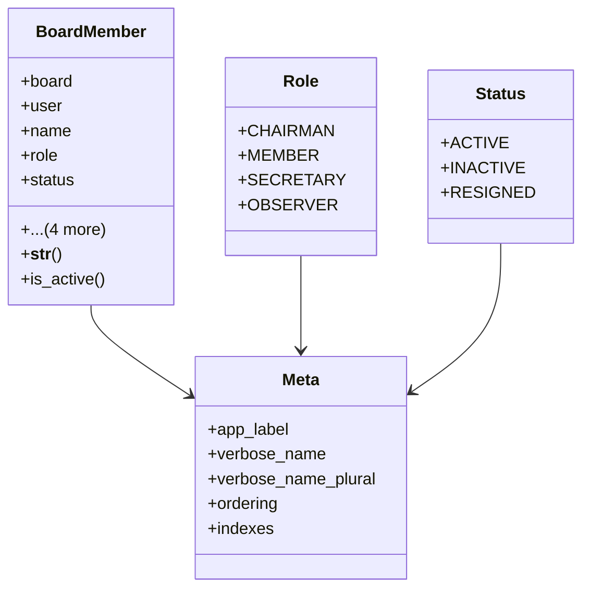

# services_modules.board_management.models.board_member

## Imports
- board
- django.contrib.auth
- django.db
- django.utils
- django.utils.translation

## Classes
- BoardMember
  - attr: `board`
  - attr: `user`
  - attr: `name`
  - attr: `role`
  - attr: `status`
  - attr: `start_date`
  - attr: `end_date`
  - attr: `created_at`
  - attr: `updated_at`
  - method: `__str__`
  - method: `is_active`
- Role
  - attr: `CHAIRMAN`
  - attr: `MEMBER`
  - attr: `SECRETARY`
  - attr: `OBSERVER`
- Status
  - attr: `ACTIVE`
  - attr: `INACTIVE`
  - attr: `RESIGNED`
- Meta
  - attr: `app_label`
  - attr: `verbose_name`
  - attr: `verbose_name_plural`
  - attr: `ordering`
  - attr: `indexes`

## Functions
- __str__
- is_active

## Module Variables
- `User`

## Class Diagram

