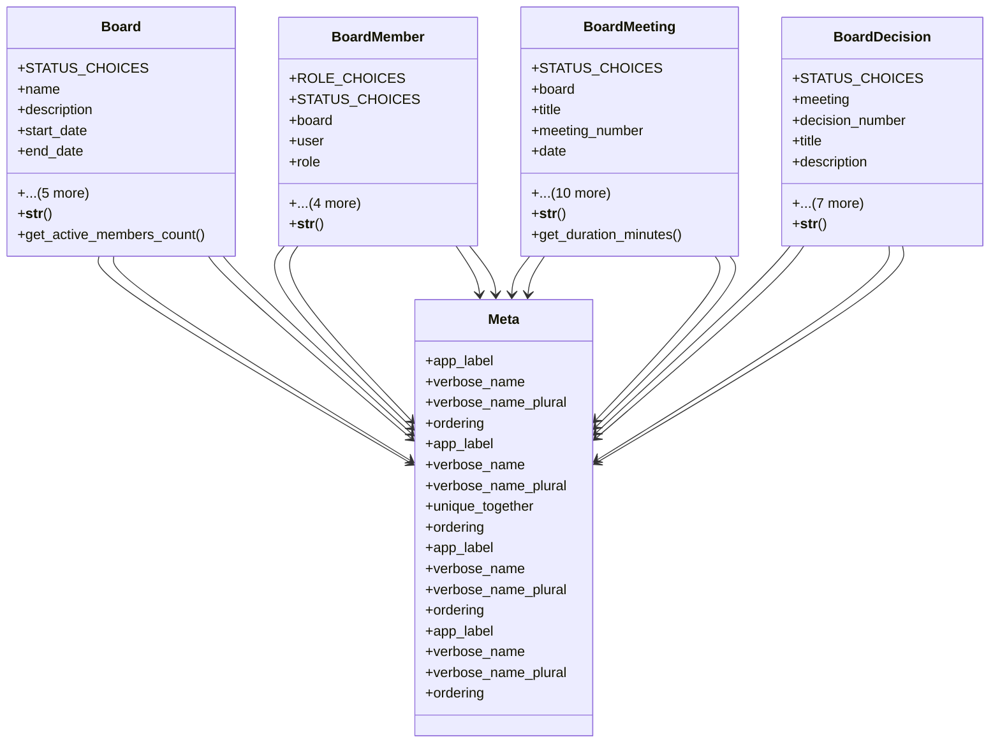

# services_modules.board_management.models

## Imports
- django.contrib.auth
- django.db
- django.utils.translation

## Classes
- Board
  - attr: `STATUS_CHOICES`
  - attr: `name`
  - attr: `description`
  - attr: `start_date`
  - attr: `end_date`
  - attr: `status`
  - attr: `chairman`
  - attr: `secretary`
  - attr: `created_at`
  - attr: `updated_at`
  - method: `__str__`
  - method: `get_active_members_count`
- BoardMember
  - attr: `ROLE_CHOICES`
  - attr: `STATUS_CHOICES`
  - attr: `board`
  - attr: `user`
  - attr: `role`
  - attr: `status`
  - attr: `start_date`
  - attr: `end_date`
  - attr: `notes`
  - method: `__str__`
- BoardMeeting
  - attr: `STATUS_CHOICES`
  - attr: `board`
  - attr: `title`
  - attr: `meeting_number`
  - attr: `date`
  - attr: `start_time`
  - attr: `end_time`
  - attr: `location`
  - attr: `status`
  - attr: `agenda`
  - attr: `minutes`
  - attr: `attendees`
  - attr: `created_by`
  - attr: `created_at`
  - attr: `updated_at`
  - method: `__str__`
  - method: `get_duration_minutes`
- BoardDecision
  - attr: `STATUS_CHOICES`
  - attr: `meeting`
  - attr: `decision_number`
  - attr: `title`
  - attr: `description`
  - attr: `status`
  - attr: `decision_date`
  - attr: `implementation_date`
  - attr: `responsible`
  - attr: `notes`
  - attr: `created_at`
  - attr: `updated_at`
  - method: `__str__`
- Meta
  - attr: `app_label`
  - attr: `verbose_name`
  - attr: `verbose_name_plural`
  - attr: `ordering`
- Meta
  - attr: `app_label`
  - attr: `verbose_name`
  - attr: `verbose_name_plural`
  - attr: `unique_together`
  - attr: `ordering`
- Meta
  - attr: `app_label`
  - attr: `verbose_name`
  - attr: `verbose_name_plural`
  - attr: `ordering`
- Meta
  - attr: `app_label`
  - attr: `verbose_name`
  - attr: `verbose_name_plural`
  - attr: `ordering`

## Functions
- __str__
- get_active_members_count
- __str__
- __str__
- get_duration_minutes
- __str__

## Module Variables
- `User`

## Class Diagram

