# services_modules.board_management.tests.test_board_management

## Imports
- datetime
- decimal
- django.core.exceptions
- django.db
- django.test
- django.utils
- models.board
- models.decision
- models.meeting
- services_modules.core.models

## Classes
- BoardModelTest
  - method: `setUp`
  - method: `test_create_board`
  - method: `test_unique_code_per_company`
  - method: `test_deactivate_board`
  - method: `test_get_members`
  - method: `test_get_committees`
- BoardMemberModelTest
  - method: `setUp`
  - method: `test_create_board_member`
  - method: `test_unique_user_per_board_per_period`
  - method: `test_end_date_after_start_date`
  - method: `test_deactivate_member`
  - method: `test_get_membership_duration`
- BoardCommitteeModelTest
  - method: `setUp`
  - method: `test_create_committee`
  - method: `test_unique_code_per_board`
  - method: `test_deactivate_committee`
  - method: `test_add_remove_members`
- MeetingModelTest
  - method: `setUp`
  - method: `test_create_meeting`
  - method: `test_change_meeting_status`
  - method: `test_add_agenda_items`
  - method: `test_record_minutes`
  - method: `test_record_attendance`
- DecisionStatusModelTest
  - method: `setUp`
  - method: `test_create_decision_status`
  - method: `test_unique_code_per_company`
  - method: `test_deactivate_status`
- DecisionModelTest
  - method: `setUp`
  - method: `test_create_decision`
  - method: `test_unique_decision_number_per_meeting`
  - method: `test_change_decision_status`

## Functions
- setUp
- test_create_board
- test_unique_code_per_company
- test_deactivate_board
- test_get_members
- test_get_committees
- setUp
- test_create_board_member
- test_unique_user_per_board_per_period
- test_end_date_after_start_date
- test_deactivate_member
- test_get_membership_duration
- setUp
- test_create_committee
- test_unique_code_per_board
- test_deactivate_committee
- test_add_remove_members
- setUp
- test_create_meeting
- test_change_meeting_status
- test_add_agenda_items
- test_record_minutes
- test_record_attendance
- setUp
- test_create_decision_status
- test_unique_code_per_company
- test_deactivate_status
- setUp
- test_create_decision
- test_unique_decision_number_per_meeting
- test_change_decision_status
- mock_get_members
- mock_get_committees
- mock_get_membership_duration
- mock_change_status

## Class Diagram

```mermaid
classDiagram
    class BoardModelTest {
        +setUp()
        +test_create_board()
        +test_unique_code_per_company()
        +test_deactivate_board()
        +test_get_members()
        +... (1 more)
    }
    class BoardMemberModelTest {
        +setUp()
        +test_create_board_member()
        +test_unique_user_per_board_per_period()
        +test_end_date_after_start_date()
        +test_deactivate_member()
        +... (1 more)
    }
    class BoardCommitteeModelTest {
        +setUp()
        +test_create_committee()
        +test_unique_code_per_board()
        +test_deactivate_committee()
        +test_add_remove_members()
    }
    class MeetingModelTest {
        +setUp()
        +test_create_meeting()
        +test_change_meeting_status()
        +test_add_agenda_items()
        +test_record_minutes()
        +... (1 more)
    }
    class DecisionStatusModelTest {
        +setUp()
        +test_create_decision_status()
        +test_unique_code_per_company()
        +test_deactivate_status()
    }
    class DecisionModelTest {
        +setUp()
        +test_create_decision()
        +test_unique_decision_number_per_meeting()
        +test_change_decision_status()
    }
```

