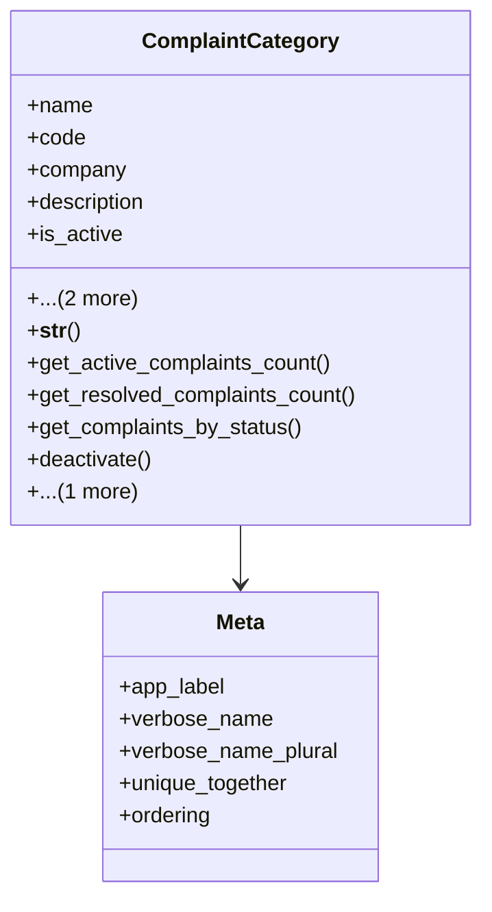

# services_modules.complaints_suggestions.models.complaint_category

## Imports
- django.db
- django.db.models
- django.utils.translation
- services_modules.core.models

## Classes
- ComplaintCategory
  - attr: `name`
  - attr: `code`
  - attr: `company`
  - attr: `description`
  - attr: `is_active`
  - attr: `created_at`
  - attr: `updated_at`
  - method: `__str__`
  - method: `get_active_complaints_count`
  - method: `get_resolved_complaints_count`
  - method: `get_complaints_by_status`
  - method: `deactivate`
  - method: `activate`
- Meta
  - attr: `app_label`
  - attr: `verbose_name`
  - attr: `verbose_name_plural`
  - attr: `unique_together`
  - attr: `ordering`

## Functions
- __str__
- get_active_complaints_count
- get_resolved_complaints_count
- get_complaints_by_status
- deactivate
- activate

## Class Diagram

