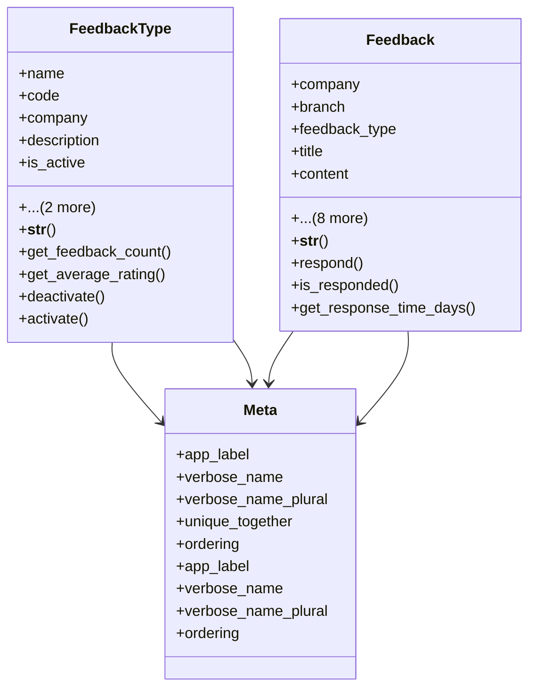

# services_modules.complaints_suggestions.models.feedback

## Imports
- django.contrib.auth
- django.db
- django.db.models
- django.utils
- django.utils.translation
- services_modules.core.models

## Classes
- FeedbackType
  - attr: `name`
  - attr: `code`
  - attr: `company`
  - attr: `description`
  - attr: `is_active`
  - attr: `created_at`
  - attr: `updated_at`
  - method: `__str__`
  - method: `get_feedback_count`
  - method: `get_average_rating`
  - method: `deactivate`
  - method: `activate`
- Feedback
  - attr: `company`
  - attr: `branch`
  - attr: `feedback_type`
  - attr: `title`
  - attr: `content`
  - attr: `rating`
  - attr: `submitted_by`
  - attr: `submission_date`
  - attr: `response`
  - attr: `responded_by`
  - attr: `response_date`
  - attr: `created_at`
  - attr: `updated_at`
  - method: `__str__`
  - method: `respond`
  - method: `is_responded`
  - method: `get_response_time_days`
- Meta
  - attr: `app_label`
  - attr: `verbose_name`
  - attr: `verbose_name_plural`
  - attr: `unique_together`
  - attr: `ordering`
- Meta
  - attr: `app_label`
  - attr: `verbose_name`
  - attr: `verbose_name_plural`
  - attr: `ordering`

## Functions
- __str__
- get_feedback_count
- get_average_rating
- deactivate
- activate
- __str__
- respond
- is_responded
- get_response_time_days

## Module Variables
- `User`

## Class Diagram

