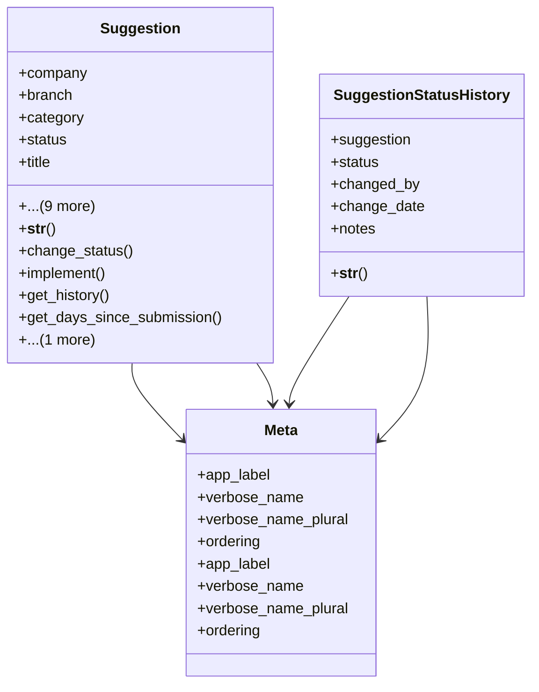

# services_modules.complaints_suggestions.models.suggestion

## Imports
- datetime
- django.contrib.auth
- django.db
- django.utils
- django.utils.translation
- services_modules.core.models
- suggestion_category
- suggestion_status

## Classes
- Suggestion
  - attr: `company`
  - attr: `branch`
  - attr: `category`
  - attr: `status`
  - attr: `title`
  - attr: `description`
  - attr: `submitted_by`
  - attr: `submission_date`
  - attr: `assigned_to`
  - attr: `implementation_date`
  - attr: `implementation_notes`
  - attr: `notes`
  - attr: `created_at`
  - attr: `updated_at`
  - method: `__str__`
  - method: `change_status`
  - method: `implement`
  - method: `get_history`
  - method: `get_days_since_submission`
  - method: `get_implementation_time_days`
- SuggestionStatusHistory
  - attr: `suggestion`
  - attr: `status`
  - attr: `changed_by`
  - attr: `change_date`
  - attr: `notes`
  - method: `__str__`
- Meta
  - attr: `app_label`
  - attr: `verbose_name`
  - attr: `verbose_name_plural`
  - attr: `ordering`
- Meta
  - attr: `app_label`
  - attr: `verbose_name`
  - attr: `verbose_name_plural`
  - attr: `ordering`

## Functions
- __str__
- change_status
- implement
- get_history
- get_days_since_submission
- get_implementation_time_days
- __str__

## Module Variables
- `User`

## Class Diagram

