# services_modules.complaints_suggestions.tests.test_complaints_suggestions

## Imports
- datetime
- decimal
- django.core.exceptions
- django.db
- django.test
- django.utils
- models.complaint
- models.feedback
- models.suggestion
- services_modules.core.models

## Classes
- ComplaintCategoryModelTest
  - method: `setUp`
  - method: `test_create_category`
  - method: `test_unique_code_per_company`
  - method: `test_deactivate_category`
- ComplaintStatusModelTest
  - method: `setUp`
  - method: `test_create_status`
  - method: `test_unique_code_per_company`
  - method: `test_deactivate_status`
- ComplaintModelTest
  - method: `setUp`
  - method: `test_create_complaint`
  - method: `test_change_complaint_status`
  - method: `test_resolve_complaint`
  - method: `test_get_complaint_history`
- SuggestionCategoryModelTest
  - method: `setUp`
  - method: `test_create_category`
  - method: `test_unique_code_per_company`
  - method: `test_deactivate_category`
- SuggestionStatusModelTest
  - method: `setUp`
  - method: `test_create_status`
  - method: `test_unique_code_per_company`
  - method: `test_deactivate_status`
- SuggestionModelTest
  - method: `setUp`
  - method: `test_create_suggestion`
  - method: `test_change_suggestion_status`
  - method: `test_implement_suggestion`
  - method: `test_get_suggestion_history`
- FeedbackTypeModelTest
  - method: `setUp`
  - method: `test_create_feedback_type`
  - method: `test_unique_code_per_company`
  - method: `test_deactivate_feedback_type`
- FeedbackModelTest
  - method: `setUp`
  - method: `test_create_feedback`
  - method: `test_respond_to_feedback`
  - method: `test_validate_rating_range`

## Functions
- setUp
- test_create_category
- test_unique_code_per_company
- test_deactivate_category
- setUp
- test_create_status
- test_unique_code_per_company
- test_deactivate_status
- setUp
- test_create_complaint
- test_change_complaint_status
- test_resolve_complaint
- test_get_complaint_history
- setUp
- test_create_category
- test_unique_code_per_company
- test_deactivate_category
- setUp
- test_create_status
- test_unique_code_per_company
- test_deactivate_status
- setUp
- test_create_suggestion
- test_change_suggestion_status
- test_implement_suggestion
- test_get_suggestion_history
- setUp
- test_create_feedback_type
- test_unique_code_per_company
- test_deactivate_feedback_type
- setUp
- test_create_feedback
- test_respond_to_feedback
- test_validate_rating_range
- mock_change_status
- mock_resolve
- mock_get_history
- mock_change_status
- mock_implement
- mock_get_history
- mock_respond

## Class Diagram

```mermaid
classDiagram
    class ComplaintCategoryModelTest {
        +setUp()
        +test_create_category()
        +test_unique_code_per_company()
        +test_deactivate_category()
    }
    class ComplaintStatusModelTest {
        +setUp()
        +test_create_status()
        +test_unique_code_per_company()
        +test_deactivate_status()
    }
    class ComplaintModelTest {
        +setUp()
        +test_create_complaint()
        +test_change_complaint_status()
        +test_resolve_complaint()
        +test_get_complaint_history()
    }
    class SuggestionCategoryModelTest {
        +setUp()
        +test_create_category()
        +test_unique_code_per_company()
        +test_deactivate_category()
    }
    class SuggestionStatusModelTest {
        +setUp()
        +test_create_status()
        +test_unique_code_per_company()
        +test_deactivate_status()
    }
    class SuggestionModelTest {
        +setUp()
        +test_create_suggestion()
        +test_change_suggestion_status()
        +test_implement_suggestion()
        +test_get_suggestion_history()
    }
    class FeedbackTypeModelTest {
        +setUp()
        +test_create_feedback_type()
        +test_unique_code_per_company()
        +test_deactivate_feedback_type()
    }
    class FeedbackModelTest {
        +setUp()
        +test_create_feedback()
        +test_respond_to_feedback()
        +test_validate_rating_range()
    }
```

