# services_modules.compliance.models

## Imports
- dateutil.relativedelta
- django.contrib.auth
- django.contrib.contenttypes.fields
- django.contrib.contenttypes.models
- django.core.validators
- django.db
- django.utils
- django.utils.translation

## Classes
- ComplianceFramework
  - attr: `name`
  - attr: `code`
  - attr: `description`
  - attr: `version`
  - attr: `effective_date`
  - attr: `expiry_date`
  - attr: `issuing_authority`
  - attr: `scope`
  - attr: `is_mandatory`
  - attr: `is_active`
  - attr: `created_by`
  - attr: `created_at`
  - attr: `updated_at`
  - method: `__str__`
  - method: `is_expired`
- Regulation
  - attr: `REGULATION_TYPE_CHOICES`
  - attr: `PRIORITY_CHOICES`
  - attr: `framework`
  - attr: `title`
  - attr: `code`
  - attr: `regulation_type`
  - attr: `description`
  - attr: `content`
  - attr: `priority`
  - attr: `effective_date`
  - attr: `review_date`
  - attr: `next_review_date`
  - attr: `responsible_department`
  - attr: `responsible_person`
  - attr: `tags`
  - attr: `is_active`
  - attr: `created_by`
  - attr: `created_at`
  - attr: `updated_at`
  - method: `__str__`
  - method: `needs_review`
- Policy
  - attr: `STATUS_CHOICES`
  - attr: `POLICY_TYPE_CHOICES`
  - attr: `title`
  - attr: `code`
  - attr: `policy_type`
  - attr: `description`
  - attr: `content`
  - attr: `purpose`
  - attr: `scope`
  - attr: `status`
  - attr: `version`
  - attr: `effective_date`
  - attr: `review_cycle_months`
  - attr: `next_review_date`
  - attr: `owner`
  - attr: `approver`
  - attr: `approval_date`
  - attr: `applicable_departments`
  - attr: `related_regulations`
  - attr: `attachments`
  - attr: `created_by`
  - attr: `created_at`
  - attr: `updated_at`
  - method: `__str__`
  - method: `save`
- ComplianceRequirement
  - attr: `STATUS_CHOICES`
  - attr: `CRITICALITY_CHOICES`
  - attr: `regulation`
  - attr: `title`
  - attr: `description`
  - attr: `requirement_text`
  - attr: `criticality`
  - attr: `status`
  - attr: `due_date`
  - attr: `completion_date`
  - attr: `assigned_to`
  - attr: `responsible_department`
  - attr: `evidence_required`
  - attr: `evidence_provided`
  - attr: `implementation_notes`
  - attr: `compliance_percentage`
  - attr: `created_by`
  - attr: `created_at`
  - attr: `updated_at`
  - method: `__str__`
  - method: `is_overdue`
  - method: `save`
- ComplianceAssessment
  - attr: `ASSESSMENT_TYPE_CHOICES`
  - attr: `STATUS_CHOICES`
  - attr: `title`
  - attr: `assessment_type`
  - attr: `framework`
  - attr: `scope`
  - attr: `objectives`
  - attr: `methodology`
  - attr: `status`
  - attr: `start_date`
  - attr: `end_date`
  - attr: `assessor`
  - attr: `assessment_team`
  - attr: `overall_score`
  - attr: `findings`
  - attr: `recommendations`
  - attr: `action_plan`
  - attr: `report_file`
  - attr: `created_by`
  - attr: `created_at`
  - attr: `updated_at`
  - method: `__str__`
- ComplianceAudit
  - attr: `AUDIT_TYPE_CHOICES`
  - attr: `STATUS_CHOICES`
  - attr: `RESULT_CHOICES`
  - attr: `title`
  - attr: `audit_type`
  - attr: `framework`
  - attr: `scope`
  - attr: `objectives`
  - attr: `status`
  - attr: `start_date`
  - attr: `end_date`
  - attr: `auditor`
  - attr: `audit_firm`
  - attr: `audit_team`
  - attr: `result`
  - attr: `findings`
  - attr: `non_conformities`
  - attr: `recommendations`
  - attr: `corrective_actions`
  - attr: `follow_up_date`
  - attr: `certificate_issued`
  - attr: `certificate_expiry`
  - attr: `report_file`
  - attr: `created_by`
  - attr: `created_at`
  - attr: `updated_at`
  - method: `__str__`
- ComplianceRisk
  - attr: `RISK_CATEGORY_CHOICES`
  - attr: `PROBABILITY_CHOICES`
  - attr: `IMPACT_CHOICES`
  - attr: `STATUS_CHOICES`
  - attr: `title`
  - attr: `description`
  - attr: `risk_category`
  - attr: `related_regulation`
  - attr: `probability`
  - attr: `impact`
  - attr: `risk_score`
  - attr: `status`
  - attr: `owner`
  - attr: `mitigation_strategy`
  - attr: `mitigation_actions`
  - attr: `target_date`
  - attr: `residual_probability`
  - attr: `residual_impact`
  - attr: `residual_score`
  - attr: `review_date`
  - attr: `created_by`
  - attr: `created_at`
  - attr: `updated_at`
  - method: `__str__`
  - method: `calculate_risk_score`
  - method: `save`
- ComplianceIncident
  - attr: `SEVERITY_CHOICES`
  - attr: `STATUS_CHOICES`
  - attr: `title`
  - attr: `description`
  - attr: `incident_date`
  - attr: `reported_date`
  - attr: `reported_by`
  - attr: `affected_regulation`
  - attr: `severity`
  - attr: `status`
  - attr: `assigned_to`
  - attr: `root_cause`
  - attr: `immediate_actions`
  - attr: `corrective_actions`
  - attr: `preventive_actions`
  - attr: `resolution_date`
  - attr: `lessons_learned`
  - attr: `cost_impact`
  - attr: `regulatory_notification`
  - attr: `notification_date`
  - attr: `attachments`
  - attr: `created_at`
  - attr: `updated_at`
  - method: `__str__`
- ComplianceTraining
  - attr: `STATUS_CHOICES`
  - attr: `title`
  - attr: `description`
  - attr: `related_framework`
  - attr: `target_audience`
  - attr: `objectives`
  - attr: `content_outline`
  - attr: `duration_hours`
  - attr: `delivery_method`
  - attr: `trainer`
  - attr: `start_date`
  - attr: `end_date`
  - attr: `location`
  - attr: `max_participants`
  - attr: `enrolled_count`
  - attr: `completion_rate`
  - attr: `status`
  - attr: `materials`
  - attr: `assessment_method`
  - attr: `certificate_template`
  - attr: `feedback_summary`
  - attr: `created_by`
  - attr: `created_at`
  - attr: `updated_at`
  - method: `__str__`
- ComplianceReport
  - attr: `REPORT_TYPE_CHOICES`
  - attr: `FREQUENCY_CHOICES`
  - attr: `title`
  - attr: `report_type`
  - attr: `description`
  - attr: `frequency`
  - attr: `framework`
  - attr: `report_period_start`
  - attr: `report_period_end`
  - attr: `generated_date`
  - attr: `generated_by`
  - attr: `recipients`
  - attr: `executive_summary`
  - attr: `key_findings`
  - attr: `recommendations`
  - attr: `action_items`
  - attr: `compliance_score`
  - attr: `report_file`
  - attr: `is_published`
  - attr: `published_date`
  - method: `__str__`
  - method: `save`
- ComplianceDocument
  - attr: `DOCUMENT_TYPE_CHOICES`
  - attr: `title`
  - attr: `document_type`
  - attr: `description`
  - attr: `related_framework`
  - attr: `related_regulation`
  - attr: `version`
  - attr: `file_path`
  - attr: `file_size`
  - attr: `file_type`
  - attr: `checksum`
  - attr: `access_level`
  - attr: `owner`
  - attr: `approver`
  - attr: `approval_date`
  - attr: `effective_date`
  - attr: `review_date`
  - attr: `retention_period_years`
  - attr: `tags`
  - attr: `download_count`
  - attr: `is_active`
  - attr: `created_by`
  - attr: `created_at`
  - attr: `updated_at`
  - method: `__str__`
- Meta
  - attr: `app_label`
  - attr: `verbose_name`
  - attr: `verbose_name_plural`
  - attr: `ordering`
- Meta
  - attr: `app_label`
  - attr: `verbose_name`
  - attr: `verbose_name_plural`
  - attr: `ordering`
- Meta
  - attr: `app_label`
  - attr: `verbose_name`
  - attr: `verbose_name_plural`
  - attr: `ordering`
- Meta
  - attr: `app_label`
  - attr: `verbose_name`
  - attr: `verbose_name_plural`
  - attr: `ordering`
- Meta
  - attr: `app_label`
  - attr: `verbose_name`
  - attr: `verbose_name_plural`
  - attr: `ordering`
- Meta
  - attr: `app_label`
  - attr: `verbose_name`
  - attr: `verbose_name_plural`
  - attr: `ordering`
- Meta
  - attr: `app_label`
  - attr: `verbose_name`
  - attr: `verbose_name_plural`
  - attr: `ordering`
- Meta
  - attr: `app_label`
  - attr: `verbose_name`
  - attr: `verbose_name_plural`
  - attr: `ordering`
- Meta
  - attr: `app_label`
  - attr: `verbose_name`
  - attr: `verbose_name_plural`
  - attr: `ordering`
- Meta
  - attr: `app_label`
  - attr: `verbose_name`
  - attr: `verbose_name_plural`
  - attr: `ordering`
- Meta
  - attr: `app_label`
  - attr: `verbose_name`
  - attr: `verbose_name_plural`
  - attr: `ordering`

## Functions
- __str__
- is_expired
- __str__
- needs_review
- __str__
- save
- __str__
- is_overdue
- save
- __str__
- __str__
- __str__
- calculate_risk_score
- save
- __str__
- __str__
- __str__
- save
- __str__

## Module Variables
- `User`

## Class Diagram

```mermaid
classDiagram
    class ComplianceFramework {
        +name
        +code
        +description
        +version
        +effective_date
        +... (8 more)
        +__str__()
        +is_expired()
    }
    class Regulation {
        +REGULATION_TYPE_CHOICES
        +PRIORITY_CHOICES
        +framework
        +title
        +code
        +... (14 more)
        +__str__()
        +needs_review()
    }
    class Policy {
        +STATUS_CHOICES
        +POLICY_TYPE_CHOICES
        +title
        +code
        +policy_type
        +... (18 more)
        +__str__()
        +save()
    }
    class ComplianceRequirement {
        +STATUS_CHOICES
        +CRITICALITY_CHOICES
        +regulation
        +title
        +description
        +... (14 more)
        +__str__()
        +is_overdue()
        +save()
    }
    class ComplianceAssessment {
        +ASSESSMENT_TYPE_CHOICES
        +STATUS_CHOICES
        +title
        +assessment_type
        +framework
        +... (16 more)
        +__str__()
    }
    class ComplianceAudit {
        +AUDIT_TYPE_CHOICES
        +STATUS_CHOICES
        +RESULT_CHOICES
        +title
        +audit_type
        +... (21 more)
        +__str__()
    }
    class ComplianceRisk {
        +RISK_CATEGORY_CHOICES
        +PROBABILITY_CHOICES
        +IMPACT_CHOICES
        +STATUS_CHOICES
        +title
        +... (18 more)
        +__str__()
        +calculate_risk_score()
        +save()
    }
    class ComplianceIncident {
        +SEVERITY_CHOICES
        +STATUS_CHOICES
        +title
        +description
        +incident_date
        +... (18 more)
        +__str__()
    }
    class ComplianceTraining {
        +STATUS_CHOICES
        +title
        +description
        +related_framework
        +target_audience
        +... (19 more)
        +__str__()
    }
    class ComplianceReport {
        +REPORT_TYPE_CHOICES
        +FREQUENCY_CHOICES
        +title
        +report_type
        +description
        +... (15 more)
        +__str__()
        +save()
    }
    class ComplianceDocument {
        +DOCUMENT_TYPE_CHOICES
        +title
        +document_type
        +description
        +related_framework
        +... (19 more)
        +__str__()
    }
    class Meta {
        +app_label
        +verbose_name
        +verbose_name_plural
        +ordering
    }
    class Meta {
        +app_label
        +verbose_name
        +verbose_name_plural
        +ordering
    }
    class Meta {
        +app_label
        +verbose_name
        +verbose_name_plural
        +ordering
    }
    class Meta {
        +app_label
        +verbose_name
        +verbose_name_plural
        +ordering
    }
    class Meta {
        +app_label
        +verbose_name
        +verbose_name_plural
        +ordering
    }
    class Meta {
        +app_label
        +verbose_name
        +verbose_name_plural
        +ordering
    }
    class Meta {
        +app_label
        +verbose_name
        +verbose_name_plural
        +ordering
    }
    class Meta {
        +app_label
        +verbose_name
        +verbose_name_plural
        +ordering
    }
    class Meta {
        +app_label
        +verbose_name
        +verbose_name_plural
        +ordering
    }
    class Meta {
        +app_label
        +verbose_name
        +verbose_name_plural
        +ordering
    }
    class Meta {
        +app_label
        +verbose_name
        +verbose_name_plural
        +ordering
    }
    ComplianceFramework --> Meta
    ComplianceFramework --> Meta
    ComplianceFramework --> Meta
    ComplianceFramework --> Meta
    ComplianceFramework --> Meta
    ComplianceFramework --> Meta
    ComplianceFramework --> Meta
    ComplianceFramework --> Meta
    ComplianceFramework --> Meta
    ComplianceFramework --> Meta
    ComplianceFramework --> Meta
    Regulation --> Meta
    Regulation --> Meta
    Regulation --> Meta
    Regulation --> Meta
    Regulation --> Meta
    Regulation --> Meta
    Regulation --> Meta
    Regulation --> Meta
    Regulation --> Meta
    Regulation --> Meta
    Regulation --> Meta
    Policy --> Meta
    Policy --> Meta
    Policy --> Meta
    Policy --> Meta
    Policy --> Meta
    Policy --> Meta
    Policy --> Meta
    Policy --> Meta
    Policy --> Meta
    Policy --> Meta
    Policy --> Meta
    ComplianceRequirement --> Meta
    ComplianceRequirement --> Meta
    ComplianceRequirement --> Meta
    ComplianceRequirement --> Meta
    ComplianceRequirement --> Meta
    ComplianceRequirement --> Meta
    ComplianceRequirement --> Meta
    ComplianceRequirement --> Meta
    ComplianceRequirement --> Meta
    ComplianceRequirement --> Meta
    ComplianceRequirement --> Meta
    ComplianceAssessment --> Meta
    ComplianceAssessment --> Meta
    ComplianceAssessment --> Meta
    ComplianceAssessment --> Meta
    ComplianceAssessment --> Meta
    ComplianceAssessment --> Meta
    ComplianceAssessment --> Meta
    ComplianceAssessment --> Meta
    ComplianceAssessment --> Meta
    ComplianceAssessment --> Meta
    ComplianceAssessment --> Meta
    ComplianceAudit --> Meta
    ComplianceAudit --> Meta
    ComplianceAudit --> Meta
    ComplianceAudit --> Meta
    ComplianceAudit --> Meta
    ComplianceAudit --> Meta
    ComplianceAudit --> Meta
    ComplianceAudit --> Meta
    ComplianceAudit --> Meta
    ComplianceAudit --> Meta
    ComplianceAudit --> Meta
    ComplianceRisk --> Meta
    ComplianceRisk --> Meta
    ComplianceRisk --> Meta
    ComplianceRisk --> Meta
    ComplianceRisk --> Meta
    ComplianceRisk --> Meta
    ComplianceRisk --> Meta
    ComplianceRisk --> Meta
    ComplianceRisk --> Meta
    ComplianceRisk --> Meta
    ComplianceRisk --> Meta
    ComplianceIncident --> Meta
    ComplianceIncident --> Meta
    ComplianceIncident --> Meta
    ComplianceIncident --> Meta
    ComplianceIncident --> Meta
    ComplianceIncident --> Meta
    ComplianceIncident --> Meta
    ComplianceIncident --> Meta
    ComplianceIncident --> Meta
    ComplianceIncident --> Meta
    ComplianceIncident --> Meta
    ComplianceTraining --> Meta
    ComplianceTraining --> Meta
    ComplianceTraining --> Meta
    ComplianceTraining --> Meta
    ComplianceTraining --> Meta
    ComplianceTraining --> Meta
    ComplianceTraining --> Meta
    ComplianceTraining --> Meta
    ComplianceTraining --> Meta
    ComplianceTraining --> Meta
    ComplianceTraining --> Meta
    ComplianceReport --> Meta
    ComplianceReport --> Meta
    ComplianceReport --> Meta
    ComplianceReport --> Meta
    ComplianceReport --> Meta
    ComplianceReport --> Meta
    ComplianceReport --> Meta
    ComplianceReport --> Meta
    ComplianceReport --> Meta
    ComplianceReport --> Meta
    ComplianceReport --> Meta
    ComplianceDocument --> Meta
    ComplianceDocument --> Meta
    ComplianceDocument --> Meta
    ComplianceDocument --> Meta
    ComplianceDocument --> Meta
    ComplianceDocument --> Meta
    ComplianceDocument --> Meta
    ComplianceDocument --> Meta
    ComplianceDocument --> Meta
    ComplianceDocument --> Meta
    ComplianceDocument --> Meta
```

