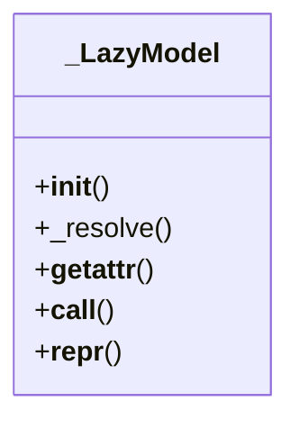

# services_modules.core.models

## Imports
- __future__
- django.apps
- django.core.exceptions
- importlib
- typing

## Classes
- _LazyModel
  - method: `__init__`
  - method: `_resolve`
  - method: `__getattr__`
  - method: `__call__`
  - method: `__repr__`

## Functions
- _bind_eager
- _upgrade_lazy_models
- __init__
- _resolve
- __getattr__
- __call__
- __repr__

## Module Variables
- `__all__`
- `Company`
- `Branch`
- `Currency`
- `User`
- `Partner`

## Class Diagram

