# services_modules.correspondence.admin

## Imports
- django.contrib
- django.urls
- django.utils.html
- django.utils.translation
- models

## Classes
- CorrespondenceAttachmentInline
  - attr: `model`
  - attr: `extra`
  - attr: `readonly_fields`
  - attr: `fields`
  - method: `has_change_permission`
- CorrespondenceCommentInline
  - attr: `model`
  - attr: `extra`
  - attr: `readonly_fields`
  - attr: `fields`
- CorrespondenceHistoryInline
  - attr: `model`
  - attr: `extra`
  - attr: `can_delete`
  - attr: `readonly_fields`
  - attr: `fields`
  - method: `has_add_permission`
  - method: `has_change_permission`
- CorrespondenceCategoryAdmin
  - attr: `list_display`
  - attr: `list_filter`
  - attr: `search_fields`
  - attr: `readonly_fields`
  - attr: `fieldsets`
- CorrespondenceAdmin
  - attr: `list_display`
  - attr: `list_filter`
  - attr: `search_fields`
  - attr: `readonly_fields`
  - attr: `date_hierarchy`
  - attr: `inlines`
  - attr: `fieldsets`
  - method: `correspondence_type_display`
  - method: `status_display`
  - method: `priority_display`
  - method: `save_model`
  - method: `save_formset`
- CorrespondenceAttachmentAdmin
  - attr: `list_display`
  - attr: `list_filter`
  - attr: `search_fields`
  - attr: `readonly_fields`
  - attr: `fields`
  - method: `correspondence_link`
  - method: `save_model`
- CorrespondenceCommentAdmin
  - attr: `list_display`
  - attr: `list_filter`
  - attr: `search_fields`
  - attr: `readonly_fields`
  - attr: `fields`
  - method: `content_preview`
  - method: `correspondence_link`
  - method: `save_model`
- CorrespondenceHistoryAdmin
  - attr: `list_display`
  - attr: `list_filter`
  - attr: `search_fields`
  - attr: `readonly_fields`
  - attr: `date_hierarchy`
  - method: `description_preview`
  - method: `correspondence_link`
  - method: `has_add_permission`
  - method: `has_change_permission`
  - method: `has_delete_permission`

## Functions
- has_change_permission
- has_add_permission
- has_change_permission
- correspondence_type_display
- status_display
- priority_display
- save_model
- save_formset
- correspondence_link
- save_model
- content_preview
- correspondence_link
- save_model
- description_preview
- correspondence_link
- has_add_permission
- has_change_permission
- has_delete_permission

## Class Diagram

```mermaid
classDiagram
    class CorrespondenceAttachmentInline {
        +model
        +extra
        +readonly_fields
        +fields
        +has_change_permission()
    }
    class CorrespondenceCommentInline {
        +model
        +extra
        +readonly_fields
        +fields
    }
    class CorrespondenceHistoryInline {
        +model
        +extra
        +can_delete
        +readonly_fields
        +fields
        +has_add_permission()
        +has_change_permission()
    }
    class CorrespondenceCategoryAdmin {
        +list_display
        +list_filter
        +search_fields
        +readonly_fields
        +fieldsets
    }
    class CorrespondenceAdmin {
        +list_display
        +list_filter
        +search_fields
        +readonly_fields
        +date_hierarchy
        +... (2 more)
        +correspondence_type_display()
        +status_display()
        +priority_display()
        +save_model()
        +save_formset()
    }
    class CorrespondenceAttachmentAdmin {
        +list_display
        +list_filter
        +search_fields
        +readonly_fields
        +fields
        +correspondence_link()
        +save_model()
    }
    class CorrespondenceCommentAdmin {
        +list_display
        +list_filter
        +search_fields
        +readonly_fields
        +fields
        +content_preview()
        +correspondence_link()
        +save_model()
    }
    class CorrespondenceHistoryAdmin {
        +list_display
        +list_filter
        +search_fields
        +readonly_fields
        +date_hierarchy
        +description_preview()
        +correspondence_link()
        +has_add_permission()
        +has_change_permission()
        +has_delete_permission()
    }
```

