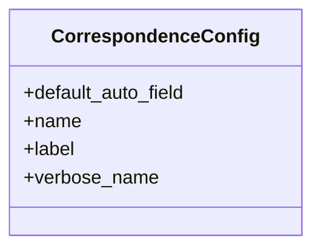

# services_modules.correspondence.apps

## Imports
- django.apps

## Classes
- CorrespondenceConfig
  - attr: `default_auto_field`
  - attr: `name`
  - attr: `label`
  - attr: `verbose_name`

## Class Diagram

