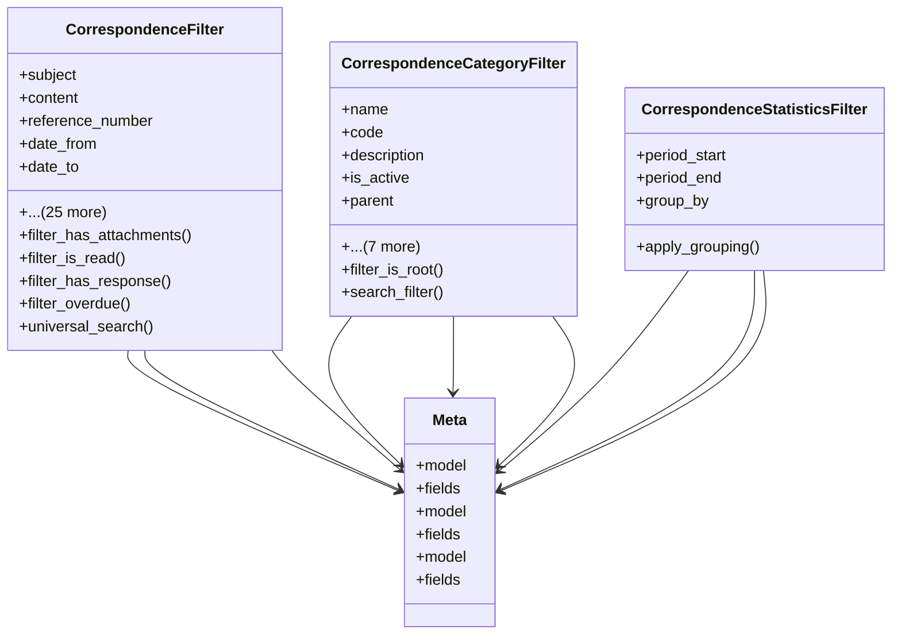

# services_modules.correspondence.filters

## Imports
- django.contrib.auth
- django.db.models
- django.utils
- django.utils.translation
- django_filters
- models

## Classes
- CorrespondenceFilter
  - attr: `subject`
  - attr: `content`
  - attr: `reference_number`
  - attr: `date_from`
  - attr: `date_to`
  - attr: `date_range`
  - attr: `correspondence_type`
  - attr: `status`
  - attr: `priority`
  - attr: `status_in`
  - attr: `priority_in`
  - attr: `category`
  - attr: `category_id`
  - attr: `tags`
  - attr: `is_confidential`
  - attr: `is_archived`
  - attr: `has_attachments`
  - attr: `is_read`
  - attr: `created_at_from`
  - attr: `created_at_to`
  - attr: `created_at_range`
  - attr: `created_by`
  - attr: `created_by_username`
  - attr: `assigned_to`
  - attr: `response_required`
  - attr: `has_response`
  - attr: `response_deadline`
  - attr: `overdue`
  - attr: `search`
  - attr: `ordering`
  - method: `filter_has_attachments`
  - method: `filter_is_read`
  - method: `filter_has_response`
  - method: `filter_overdue`
  - method: `universal_search`
- CorrespondenceCategoryFilter
  - attr: `name`
  - attr: `code`
  - attr: `description`
  - attr: `is_active`
  - attr: `parent`
  - attr: `is_root`
  - attr: `min_usage_count`
  - attr: `max_usage_count`
  - attr: `created_after`
  - attr: `created_before`
  - attr: `search`
  - attr: `ordering`
  - method: `filter_is_root`
  - method: `search_filter`
- CorrespondenceStatisticsFilter
  - attr: `period_start`
  - attr: `period_end`
  - attr: `group_by`
  - method: `apply_grouping`
- Meta
  - attr: `model`
  - attr: `fields`
- Meta
  - attr: `model`
  - attr: `fields`
- Meta
  - attr: `model`
  - attr: `fields`

## Functions
- filter_has_attachments
- filter_is_read
- filter_has_response
- filter_overdue
- universal_search
- filter_is_root
- search_filter
- apply_grouping

## Module Variables
- `User`

## Class Diagram

