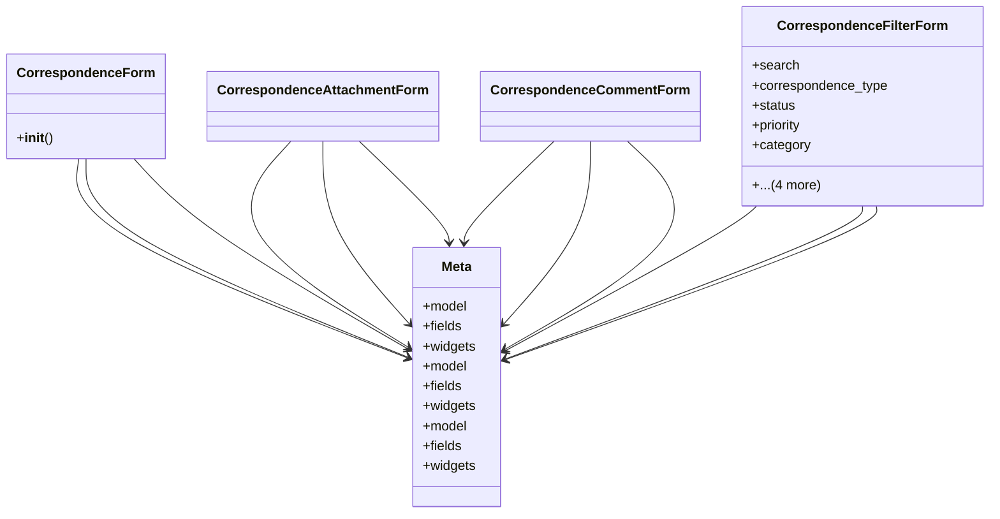

# services_modules.correspondence.forms

## Imports
- django
- django.utils.translation
- models

## Classes
- CorrespondenceForm
  - method: `__init__`
- CorrespondenceAttachmentForm
- CorrespondenceCommentForm
- CorrespondenceFilterForm
  - attr: `search`
  - attr: `correspondence_type`
  - attr: `status`
  - attr: `priority`
  - attr: `category`
  - attr: `date_from`
  - attr: `date_to`
  - attr: `is_confidential`
  - attr: `is_archived`
- Meta
  - attr: `model`
  - attr: `fields`
  - attr: `widgets`
- Meta
  - attr: `model`
  - attr: `fields`
  - attr: `widgets`
- Meta
  - attr: `model`
  - attr: `fields`
  - attr: `widgets`

## Functions
- __init__

## Class Diagram

