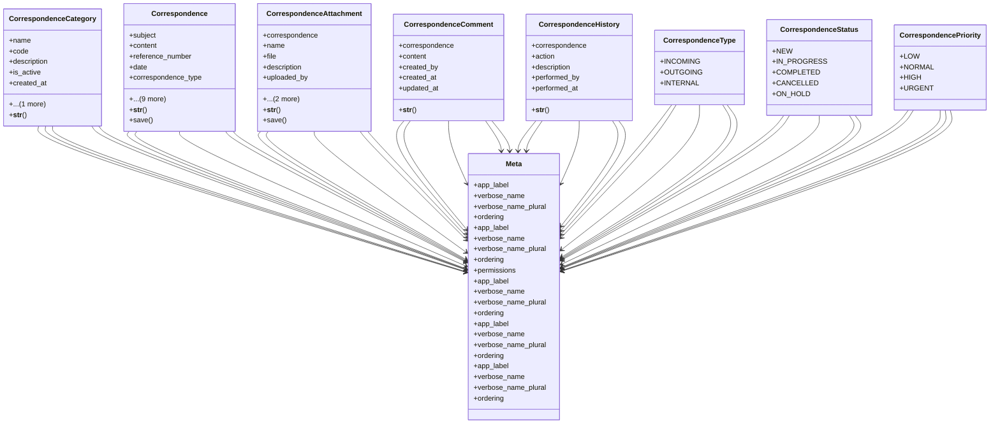

# services_modules.correspondence.models

## Imports
- django.conf
- django.db
- django.utils
- django.utils.translation

## Classes
- CorrespondenceCategory
  - attr: `name`
  - attr: `code`
  - attr: `description`
  - attr: `is_active`
  - attr: `created_at`
  - attr: `updated_at`
  - method: `__str__`
- Correspondence
  - attr: `subject`
  - attr: `content`
  - attr: `reference_number`
  - attr: `date`
  - attr: `correspondence_type`
  - attr: `status`
  - attr: `priority`
  - attr: `category`
  - attr: `tags`
  - attr: `is_confidential`
  - attr: `is_archived`
  - attr: `created_by`
  - attr: `created_at`
  - attr: `updated_at`
  - method: `__str__`
  - method: `save`
- CorrespondenceAttachment
  - attr: `correspondence`
  - attr: `name`
  - attr: `file`
  - attr: `description`
  - attr: `uploaded_by`
  - attr: `created_at`
  - attr: `updated_at`
  - method: `__str__`
  - method: `save`
- CorrespondenceComment
  - attr: `correspondence`
  - attr: `content`
  - attr: `created_by`
  - attr: `created_at`
  - attr: `updated_at`
  - method: `__str__`
- CorrespondenceHistory
  - attr: `correspondence`
  - attr: `action`
  - attr: `description`
  - attr: `performed_by`
  - attr: `performed_at`
  - method: `__str__`
- Meta
  - attr: `app_label`
  - attr: `verbose_name`
  - attr: `verbose_name_plural`
  - attr: `ordering`
- CorrespondenceType
  - attr: `INCOMING`
  - attr: `OUTGOING`
  - attr: `INTERNAL`
- CorrespondenceStatus
  - attr: `NEW`
  - attr: `IN_PROGRESS`
  - attr: `COMPLETED`
  - attr: `CANCELLED`
  - attr: `ON_HOLD`
- CorrespondencePriority
  - attr: `LOW`
  - attr: `NORMAL`
  - attr: `HIGH`
  - attr: `URGENT`
- Meta
  - attr: `app_label`
  - attr: `verbose_name`
  - attr: `verbose_name_plural`
  - attr: `ordering`
  - attr: `permissions`
- Meta
  - attr: `app_label`
  - attr: `verbose_name`
  - attr: `verbose_name_plural`
  - attr: `ordering`
- Meta
  - attr: `app_label`
  - attr: `verbose_name`
  - attr: `verbose_name_plural`
  - attr: `ordering`
- Meta
  - attr: `app_label`
  - attr: `verbose_name`
  - attr: `verbose_name_plural`
  - attr: `ordering`

## Functions
- __str__
- __str__
- save
- __str__
- save
- __str__
- __str__

## Module Variables
- `CorrespondenceType`
- `CorrespondenceStatus`
- `CorrespondencePriority`

## Class Diagram

