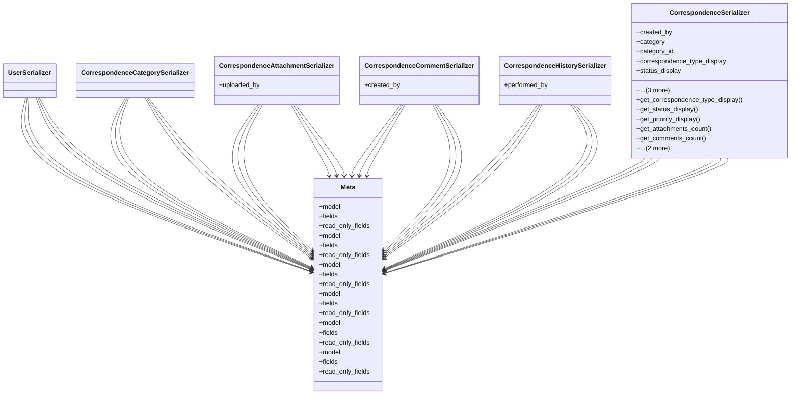

# services_modules.correspondence.serializers

## Imports
- django.contrib.auth
- django.utils.translation
- models
- rest_framework

## Classes
- UserSerializer
- CorrespondenceCategorySerializer
- CorrespondenceAttachmentSerializer
  - attr: `uploaded_by`
- CorrespondenceCommentSerializer
  - attr: `created_by`
- CorrespondenceHistorySerializer
  - attr: `performed_by`
- CorrespondenceSerializer
  - attr: `created_by`
  - attr: `category`
  - attr: `category_id`
  - attr: `correspondence_type_display`
  - attr: `status_display`
  - attr: `priority_display`
  - attr: `attachments_count`
  - attr: `comments_count`
  - method: `get_correspondence_type_display`
  - method: `get_status_display`
  - method: `get_priority_display`
  - method: `get_attachments_count`
  - method: `get_comments_count`
  - method: `validate_reference_number`
  - method: `validate`
- Meta
  - attr: `model`
  - attr: `fields`
  - attr: `read_only_fields`
- Meta
  - attr: `model`
  - attr: `fields`
  - attr: `read_only_fields`
- Meta
  - attr: `model`
  - attr: `fields`
  - attr: `read_only_fields`
- Meta
  - attr: `model`
  - attr: `fields`
  - attr: `read_only_fields`
- Meta
  - attr: `model`
  - attr: `fields`
  - attr: `read_only_fields`
- Meta
  - attr: `model`
  - attr: `fields`
  - attr: `read_only_fields`

## Functions
- get_correspondence_type_display
- get_status_display
- get_priority_display
- get_attachments_count
- get_comments_count
- validate_reference_number
- validate

## Module Variables
- `User`

## Class Diagram

