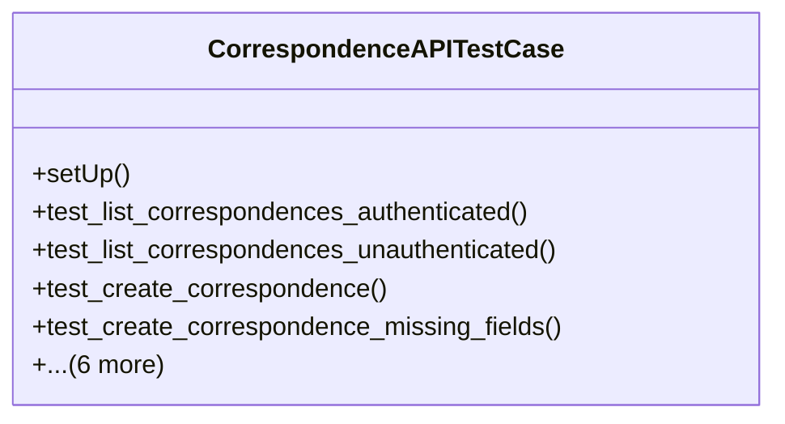

# services_modules.correspondence.tests.test_api

## Imports
- django.contrib.auth
- django.test
- django.urls
- django.utils
- models
- rest_framework
- rest_framework.test

## Classes
- CorrespondenceAPITestCase
  - method: `setUp`
  - method: `test_list_correspondences_authenticated`
  - method: `test_list_correspondences_unauthenticated`
  - method: `test_create_correspondence`
  - method: `test_create_correspondence_missing_fields`
  - method: `test_retrieve_correspondence`
  - method: `test_retrieve_nonexistent_correspondence`
  - method: `test_update_correspondence`
  - method: `test_partial_update_correspondence`
  - method: `test_delete_correspondence`
  - method: `test_delete_nonexistent_correspondence`

## Functions
- setUp
- test_list_correspondences_authenticated
- test_list_correspondences_unauthenticated
- test_create_correspondence
- test_create_correspondence_missing_fields
- test_retrieve_correspondence
- test_retrieve_nonexistent_correspondence
- test_update_correspondence
- test_partial_update_correspondence
- test_delete_correspondence
- test_delete_nonexistent_correspondence

## Module Variables
- `User`

## Class Diagram

