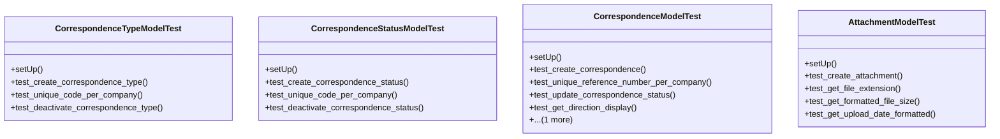

# services_modules.correspondence.tests.test_correspondence

## Imports
- datetime
- decimal
- django.core.exceptions
- django.db
- django.test
- django.utils
- models.attachment
- models.correspondence
- services_modules.core.models

## Classes
- CorrespondenceTypeModelTest
  - method: `setUp`
  - method: `test_create_correspondence_type`
  - method: `test_unique_code_per_company`
  - method: `test_deactivate_correspondence_type`
- CorrespondenceStatusModelTest
  - method: `setUp`
  - method: `test_create_correspondence_status`
  - method: `test_unique_code_per_company`
  - method: `test_deactivate_correspondence_status`
- CorrespondenceModelTest
  - method: `setUp`
  - method: `test_create_correspondence`
  - method: `test_unique_reference_number_per_company`
  - method: `test_update_correspondence_status`
  - method: `test_get_direction_display`
  - method: `test_get_formatted_date`
- AttachmentModelTest
  - method: `setUp`
  - method: `test_create_attachment`
  - method: `test_get_file_extension`
  - method: `test_get_formatted_file_size`
  - method: `test_get_upload_date_formatted`

## Functions
- setUp
- test_create_correspondence_type
- test_unique_code_per_company
- test_deactivate_correspondence_type
- setUp
- test_create_correspondence_status
- test_unique_code_per_company
- test_deactivate_correspondence_status
- setUp
- test_create_correspondence
- test_unique_reference_number_per_company
- test_update_correspondence_status
- test_get_direction_display
- test_get_formatted_date
- setUp
- test_create_attachment
- test_get_file_extension
- test_get_formatted_file_size
- test_get_upload_date_formatted
- mock_get_direction_display
- mock_get_formatted_date
- mock_get_file_extension
- mock_get_formatted_file_size
- mock_get_upload_date_formatted

## Class Diagram

