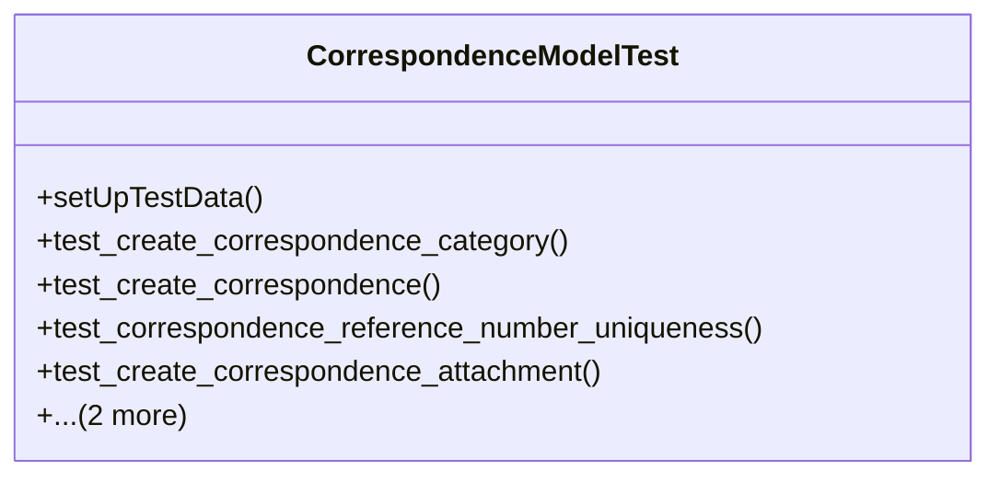

# services_modules.correspondence.tests.test_models

## Imports
- django.contrib.auth
- django.core.exceptions
- django.db
- django.test
- django.utils
- models

## Classes
- CorrespondenceModelTest
  - method: `setUpTestData`
  - method: `test_create_correspondence_category`
  - method: `test_create_correspondence`
  - method: `test_correspondence_reference_number_uniqueness`
  - method: `test_create_correspondence_attachment`
  - method: `test_create_correspondence_comment`
  - method: `test_create_correspondence_history`

## Functions
- setUpTestData
- test_create_correspondence_category
- test_create_correspondence
- test_correspondence_reference_number_uniqueness
- test_create_correspondence_attachment
- test_create_correspondence_comment
- test_create_correspondence_history

## Module Variables
- `User`

## Class Diagram

