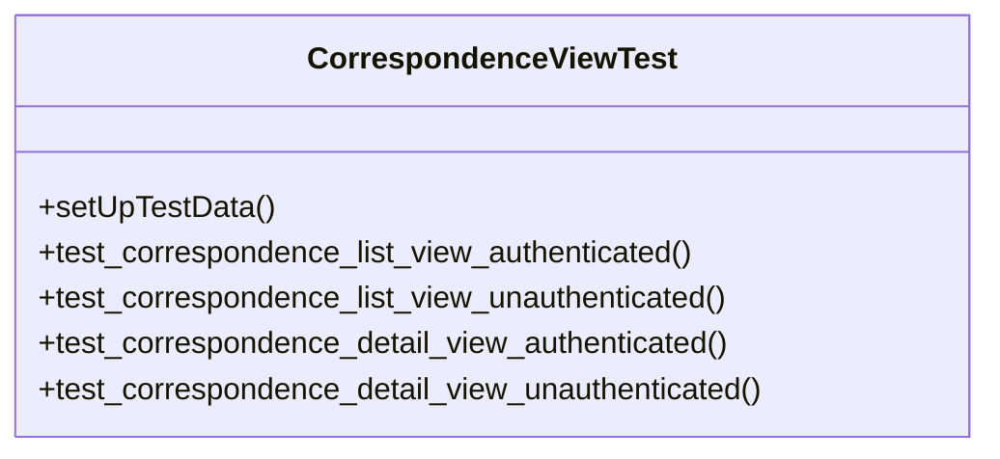

# services_modules.correspondence.tests.test_views

## Imports
- django.contrib.auth
- django.test
- django.urls
- django.utils
- models

## Classes
- CorrespondenceViewTest
  - method: `setUpTestData`
  - method: `test_correspondence_list_view_authenticated`
  - method: `test_correspondence_list_view_unauthenticated`
  - method: `test_correspondence_detail_view_authenticated`
  - method: `test_correspondence_detail_view_unauthenticated`

## Functions
- setUpTestData
- test_correspondence_list_view_authenticated
- test_correspondence_list_view_unauthenticated
- test_correspondence_detail_view_authenticated
- test_correspondence_detail_view_unauthenticated

## Module Variables
- `User`

## Class Diagram

