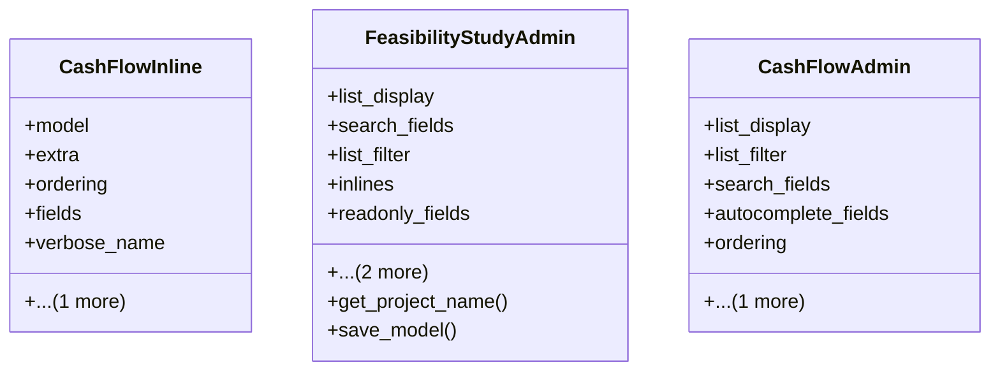

# services_modules.feasibility_studies.admin

## Imports
- django.contrib
- django.utils.translation
- models

## Classes
- CashFlowInline
  - attr: `model`
  - attr: `extra`
  - attr: `ordering`
  - attr: `fields`
  - attr: `verbose_name`
  - attr: `verbose_name_plural`
- FeasibilityStudyAdmin
  - attr: `list_display`
  - attr: `search_fields`
  - attr: `list_filter`
  - attr: `inlines`
  - attr: `readonly_fields`
  - attr: `autocomplete_fields`
  - attr: `fieldsets`
  - method: `get_project_name`
  - method: `save_model`
- CashFlowAdmin
  - attr: `list_display`
  - attr: `list_filter`
  - attr: `search_fields`
  - attr: `autocomplete_fields`
  - attr: `ordering`
  - attr: `fieldsets`

## Functions
- get_project_name
- save_model

## Class Diagram

