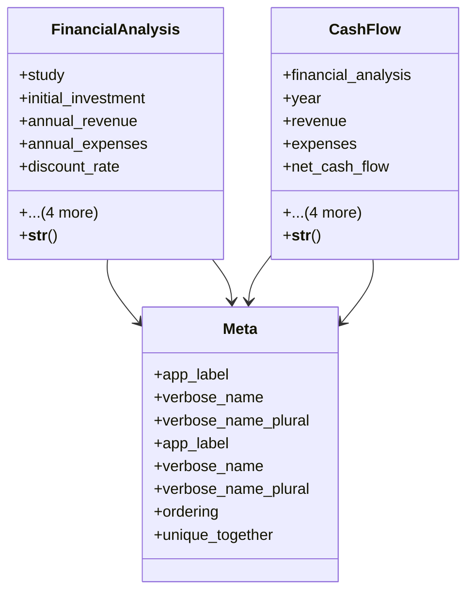

# services_modules.feasibility_studies.models.financial

## Imports
- __future__
- decimal
- django.db
- django.utils.translation
- services_modules.core.models
- study

## Classes
- FinancialAnalysis
  - attr: `study`
  - attr: `initial_investment`
  - attr: `annual_revenue`
  - attr: `annual_expenses`
  - attr: `discount_rate`
  - attr: `analysis_period`
  - attr: `created_by`
  - attr: `created_at`
  - attr: `updated_at`
  - method: `__str__`
- CashFlow
  - attr: `financial_analysis`
  - attr: `year`
  - attr: `revenue`
  - attr: `expenses`
  - attr: `net_cash_flow`
  - attr: `discounted_cash_flow`
  - attr: `created_by`
  - attr: `created_at`
  - attr: `updated_at`
  - method: `__str__`
- Meta
  - attr: `app_label`
  - attr: `verbose_name`
  - attr: `verbose_name_plural`
- Meta
  - attr: `app_label`
  - attr: `verbose_name`
  - attr: `verbose_name_plural`
  - attr: `ordering`
  - attr: `unique_together`

## Functions
- __str__
- __str__

## Class Diagram

