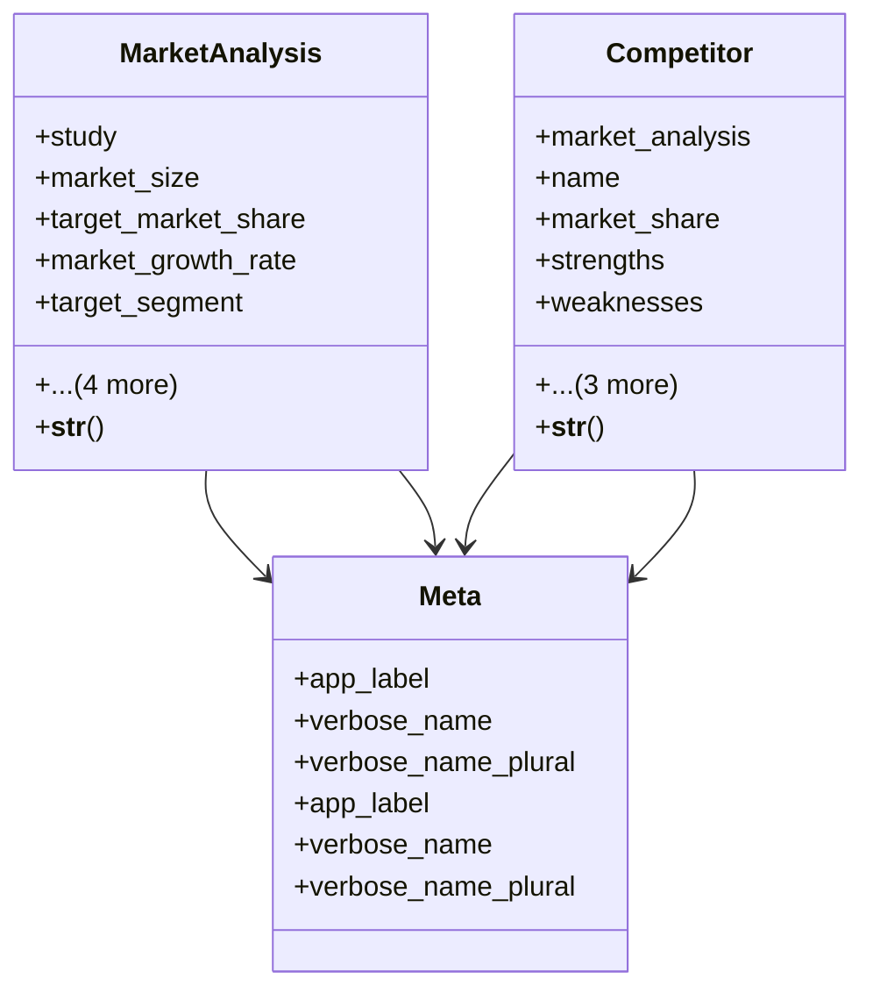

# services_modules.feasibility_studies.models.market

## Imports
- __future__
- decimal
- django.db
- django.utils.translation
- services_modules.core.models
- study

## Classes
- MarketAnalysis
  - attr: `study`
  - attr: `market_size`
  - attr: `target_market_share`
  - attr: `market_growth_rate`
  - attr: `target_segment`
  - attr: `swot_analysis`
  - attr: `created_by`
  - attr: `created_at`
  - attr: `updated_at`
  - method: `__str__`
- Competitor
  - attr: `market_analysis`
  - attr: `name`
  - attr: `market_share`
  - attr: `strengths`
  - attr: `weaknesses`
  - attr: `created_by`
  - attr: `created_at`
  - attr: `updated_at`
  - method: `__str__`
- Meta
  - attr: `app_label`
  - attr: `verbose_name`
  - attr: `verbose_name_plural`
- Meta
  - attr: `app_label`
  - attr: `verbose_name`
  - attr: `verbose_name_plural`

## Functions
- __str__
- __str__

## Class Diagram

