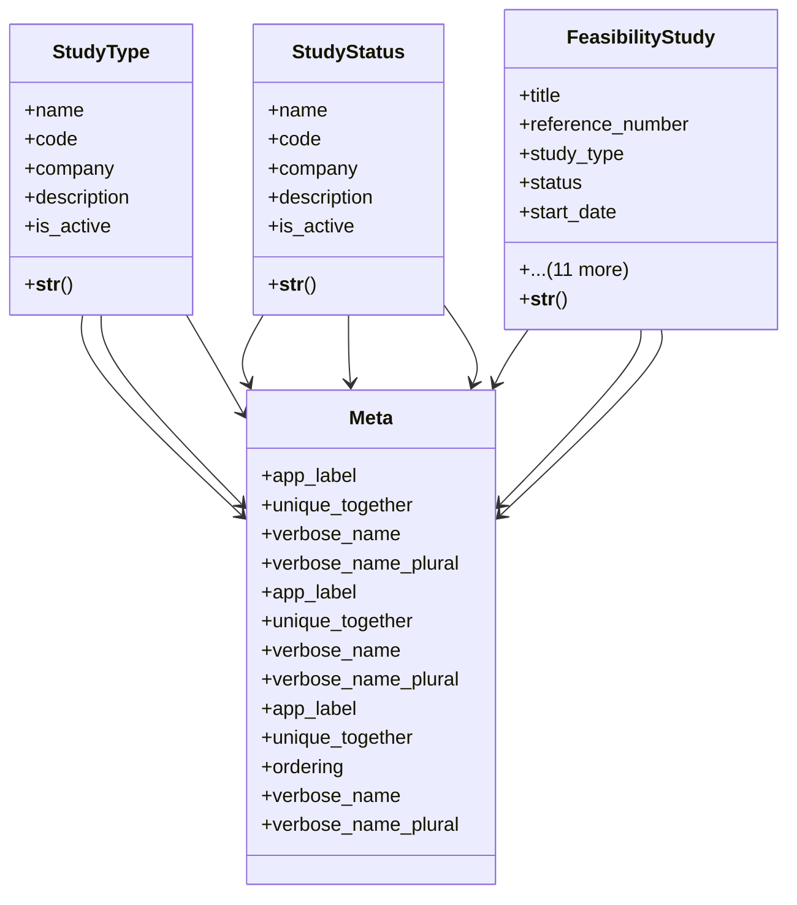

# services_modules.feasibility_studies.models.study

## Imports
- __future__
- django.conf
- django.db
- django.utils.translation
- services_modules.core.models

## Classes
- StudyType
  - attr: `name`
  - attr: `code`
  - attr: `company`
  - attr: `description`
  - attr: `is_active`
  - method: `__str__`
- StudyStatus
  - attr: `name`
  - attr: `code`
  - attr: `company`
  - attr: `description`
  - attr: `is_active`
  - method: `__str__`
- FeasibilityStudy
  - attr: `title`
  - attr: `reference_number`
  - attr: `study_type`
  - attr: `status`
  - attr: `start_date`
  - attr: `expected_end_date`
  - attr: `completion_date`
  - attr: `client_name`
  - attr: `project_cost`
  - attr: `expected_annual_revenue`
  - attr: `company`
  - attr: `branch`
  - attr: `created_by`
  - attr: `executive_summary`
  - attr: `created_at`
  - attr: `updated_at`
  - method: `__str__`
- Meta
  - attr: `app_label`
  - attr: `unique_together`
  - attr: `verbose_name`
  - attr: `verbose_name_plural`
- Meta
  - attr: `app_label`
  - attr: `unique_together`
  - attr: `verbose_name`
  - attr: `verbose_name_plural`
- Meta
  - attr: `app_label`
  - attr: `unique_together`
  - attr: `ordering`
  - attr: `verbose_name`
  - attr: `verbose_name_plural`

## Functions
- __str__
- __str__
- __str__

## Class Diagram

