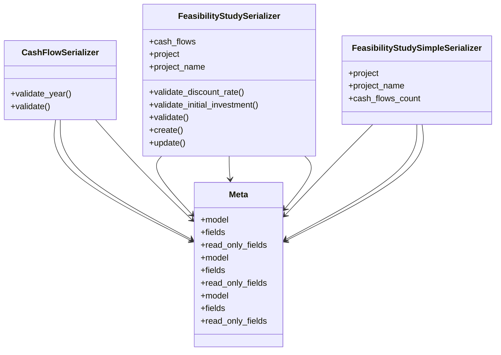

# services_modules.feasibility_studies.serializers

## Imports
- django.utils.translation
- models
- rest_framework

## Classes
- CashFlowSerializer
  - method: `validate_year`
  - method: `validate`
- FeasibilityStudySerializer
  - attr: `cash_flows`
  - attr: `project`
  - attr: `project_name`
  - method: `validate_discount_rate`
  - method: `validate_initial_investment`
  - method: `validate`
  - method: `create`
  - method: `update`
- FeasibilityStudySimpleSerializer
  - attr: `project`
  - attr: `project_name`
  - attr: `cash_flows_count`
- Meta
  - attr: `model`
  - attr: `fields`
  - attr: `read_only_fields`
- Meta
  - attr: `model`
  - attr: `fields`
  - attr: `read_only_fields`
- Meta
  - attr: `model`
  - attr: `fields`
  - attr: `read_only_fields`

## Functions
- validate_year
- validate
- validate_discount_rate
- validate_initial_investment
- validate
- create
- update

## Class Diagram

