# services_modules.feasibility_studies.tests.test_feasibility_studies

## Imports
- datetime
- decimal
- django.core.exceptions
- django.db
- django.test
- django.utils
- models.financial
- models.market
- models.study
- services_modules.core.models

## Classes
- StudyTypeModelTest
  - method: `setUp`
  - method: `test_create_study_type`
  - method: `test_unique_code_per_company`
  - method: `test_deactivate_study_type`
- StudyStatusModelTest
  - method: `setUp`
  - method: `test_create_study_status`
  - method: `test_unique_code_per_company`
  - method: `test_deactivate_study_status`
- FeasibilityStudyModelTest
  - method: `setUp`
  - method: `test_create_feasibility_study`
  - method: `test_unique_reference_number_per_company`
  - method: `test_update_study_status`
  - method: `test_calculate_roi`
  - method: `test_calculate_payback_period`
- FinancialAnalysisModelTest
  - method: `setUp`
  - method: `test_create_financial_analysis`
  - method: `test_calculate_npv`
  - method: `test_calculate_irr`
  - method: `test_calculate_roi`
- CashFlowModelTest
  - method: `setUp`
  - method: `test_create_cash_flow`
  - method: `test_calculate_net_cash_flow`
  - method: `test_calculate_discounted_cash_flow`
- MarketAnalysisModelTest
  - method: `setUp`
  - method: `test_create_market_analysis`
  - method: `test_calculate_target_market_value`
  - method: `test_calculate_projected_market_size`
- CompetitorModelTest
  - method: `setUp`
  - method: `test_create_competitor`
  - method: `test_calculate_market_value`
  - method: `test_get_relative_market_share`

## Functions
- setUp
- test_create_study_type
- test_unique_code_per_company
- test_deactivate_study_type
- setUp
- test_create_study_status
- test_unique_code_per_company
- test_deactivate_study_status
- setUp
- test_create_feasibility_study
- test_unique_reference_number_per_company
- test_update_study_status
- test_calculate_roi
- test_calculate_payback_period
- setUp
- test_create_financial_analysis
- test_calculate_npv
- test_calculate_irr
- test_calculate_roi
- setUp
- test_create_cash_flow
- test_calculate_net_cash_flow
- test_calculate_discounted_cash_flow
- setUp
- test_create_market_analysis
- test_calculate_target_market_value
- test_calculate_projected_market_size
- setUp
- test_create_competitor
- test_calculate_market_value
- test_get_relative_market_share
- mock_calculate_roi
- mock_calculate_payback_period
- mock_calculate_npv
- mock_calculate_irr
- mock_calculate_roi
- mock_calculate_net_cash_flow
- mock_calculate_discounted_cash_flow
- mock_calculate_target_market_value
- mock_calculate_projected_market_size
- mock_calculate_market_value
- mock_get_relative_market_share

## Class Diagram

```mermaid
classDiagram
    class StudyTypeModelTest {
        +setUp()
        +test_create_study_type()
        +test_unique_code_per_company()
        +test_deactivate_study_type()
    }
    class StudyStatusModelTest {
        +setUp()
        +test_create_study_status()
        +test_unique_code_per_company()
        +test_deactivate_study_status()
    }
    class FeasibilityStudyModelTest {
        +setUp()
        +test_create_feasibility_study()
        +test_unique_reference_number_per_company()
        +test_update_study_status()
        +test_calculate_roi()
        +... (1 more)
    }
    class FinancialAnalysisModelTest {
        +setUp()
        +test_create_financial_analysis()
        +test_calculate_npv()
        +test_calculate_irr()
        +test_calculate_roi()
    }
    class CashFlowModelTest {
        +setUp()
        +test_create_cash_flow()
        +test_calculate_net_cash_flow()
        +test_calculate_discounted_cash_flow()
    }
    class MarketAnalysisModelTest {
        +setUp()
        +test_create_market_analysis()
        +test_calculate_target_market_value()
        +test_calculate_projected_market_size()
    }
    class CompetitorModelTest {
        +setUp()
        +test_create_competitor()
        +test_calculate_market_value()
        +test_get_relative_market_share()
    }
```

