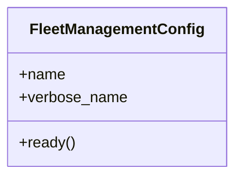

# services_modules.fleet_management.apps

## Imports
- django.apps
- services_modules.fleet_management.signals

## Classes
- FleetManagementConfig
  - attr: `name`
  - attr: `verbose_name`
  - method: `ready`

## Functions
- ready

## Class Diagram

