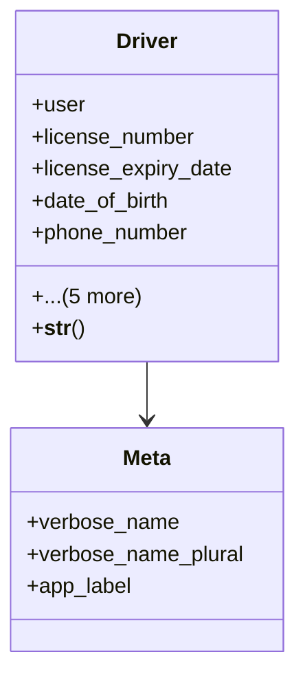

# services_modules.fleet_management.models.driver

## Imports
- django.conf
- django.db
- django.utils.translation

## Classes
- Driver
  - attr: `user`
  - attr: `license_number`
  - attr: `license_expiry_date`
  - attr: `date_of_birth`
  - attr: `phone_number`
  - attr: `emergency_contact_name`
  - attr: `emergency_contact_phone`
  - attr: `is_active`
  - attr: `created_at`
  - attr: `updated_at`
  - method: `__str__`
- Meta
  - attr: `verbose_name`
  - attr: `verbose_name_plural`
  - attr: `app_label`

## Functions
- __str__

## Class Diagram

