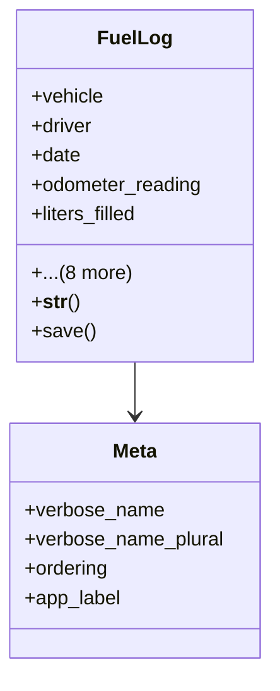

# services_modules.fleet_management.models.fuel_log

## Imports
- django.conf
- django.db
- django.utils.translation
- driver
- vehicle

## Classes
- FuelLog
  - attr: `vehicle`
  - attr: `driver`
  - attr: `date`
  - attr: `odometer_reading`
  - attr: `liters_filled`
  - attr: `price_per_liter`
  - attr: `total_cost`
  - attr: `fuel_station`
  - attr: `notes`
  - attr: `related_expense`
  - attr: `created_by`
  - attr: `created_at`
  - attr: `updated_at`
  - method: `__str__`
  - method: `save`
- Meta
  - attr: `verbose_name`
  - attr: `verbose_name_plural`
  - attr: `ordering`
  - attr: `app_label`

## Functions
- __str__
- save

## Class Diagram

