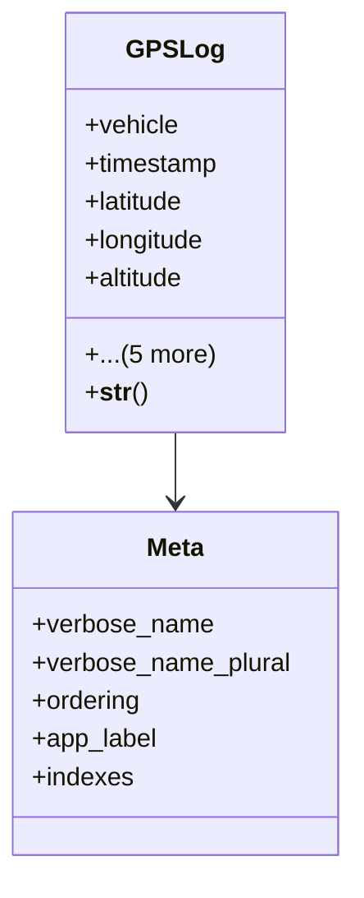

# services_modules.fleet_management.models.gps_log

## Imports
- django.db
- django.utils
- django.utils.translation
- vehicle

## Classes
- GPSLog
  - attr: `vehicle`
  - attr: `timestamp`
  - attr: `latitude`
  - attr: `longitude`
  - attr: `altitude`
  - attr: `speed`
  - attr: `direction`
  - attr: `odometer`
  - attr: `fuel_level`
  - attr: `engine_status`
  - method: `__str__`
- Meta
  - attr: `verbose_name`
  - attr: `verbose_name_plural`
  - attr: `ordering`
  - attr: `app_label`
  - attr: `indexes`

## Functions
- __str__

## Class Diagram

