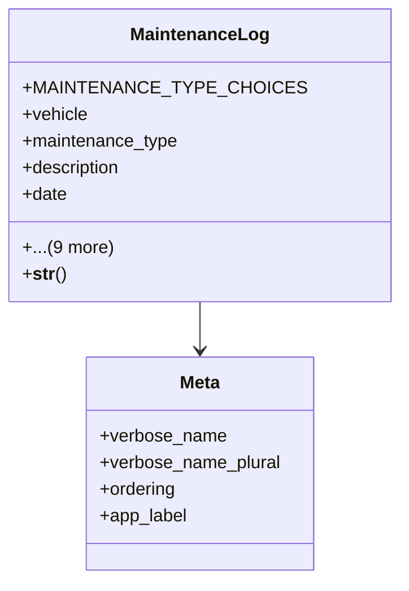

# services_modules.fleet_management.models.maintenance_log

## Imports
- django.conf
- django.db
- django.utils.translation
- vehicle

## Classes
- MaintenanceLog
  - attr: `MAINTENANCE_TYPE_CHOICES`
  - attr: `vehicle`
  - attr: `maintenance_type`
  - attr: `description`
  - attr: `date`
  - attr: `odometer_reading`
  - attr: `cost`
  - attr: `service_provider`
  - attr: `notes`
  - attr: `inventory_items_used`
  - attr: `related_expense`
  - attr: `created_by`
  - attr: `created_at`
  - attr: `updated_at`
  - method: `__str__`
- Meta
  - attr: `verbose_name`
  - attr: `verbose_name_plural`
  - attr: `ordering`
  - attr: `app_label`

## Functions
- __str__

## Class Diagram

