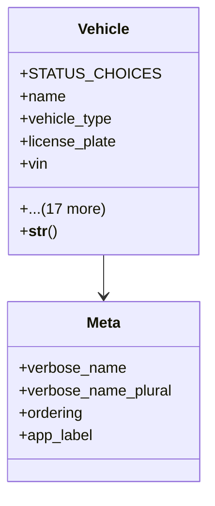

# services_modules.fleet_management.models.vehicle

## Imports
- django.conf
- django.db
- django.utils.translation
- vehicle_type

## Classes
- Vehicle
  - attr: `STATUS_CHOICES`
  - attr: `name`
  - attr: `vehicle_type`
  - attr: `license_plate`
  - attr: `vin`
  - attr: `model`
  - attr: `make`
  - attr: `year`
  - attr: `color`
  - attr: `purchase_date`
  - attr: `purchase_price`
  - attr: `current_value`
  - attr: `status`
  - attr: `odometer`
  - attr: `fuel_capacity`
  - attr: `fuel_type`
  - attr: `insurance_expiry`
  - attr: `registration_expiry`
  - attr: `gps_device_id`
  - attr: `asset`
  - attr: `created_at`
  - attr: `updated_at`
  - method: `__str__`
- Meta
  - attr: `verbose_name`
  - attr: `verbose_name_plural`
  - attr: `ordering`
  - attr: `app_label`

## Functions
- __str__

## Class Diagram

