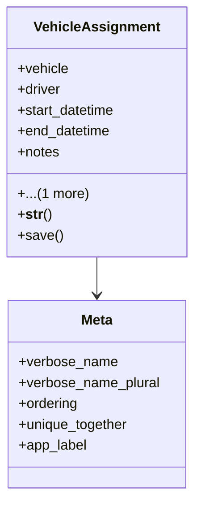

# services_modules.fleet_management.models.vehicle_assignment

## Imports
- django.db
- django.utils
- django.utils.translation
- driver
- vehicle

## Classes
- VehicleAssignment
  - attr: `vehicle`
  - attr: `driver`
  - attr: `start_datetime`
  - attr: `end_datetime`
  - attr: `notes`
  - attr: `is_active`
  - method: `__str__`
  - method: `save`
- Meta
  - attr: `verbose_name`
  - attr: `verbose_name_plural`
  - attr: `ordering`
  - attr: `unique_together`
  - attr: `app_label`

## Functions
- __str__
- save

## Class Diagram

