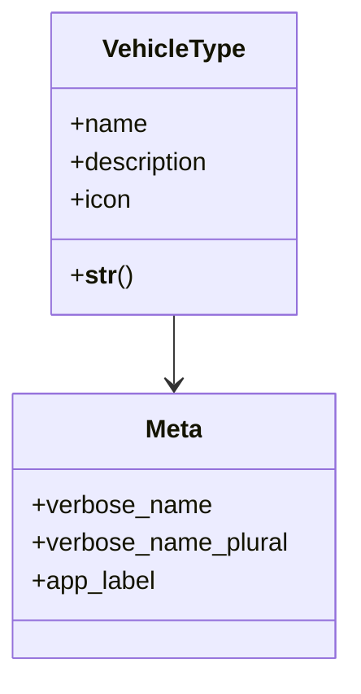

# services_modules.fleet_management.models.vehicle_type

## Imports
- django.db
- django.utils.translation

## Classes
- VehicleType
  - attr: `name`
  - attr: `description`
  - attr: `icon`
  - method: `__str__`
- Meta
  - attr: `verbose_name`
  - attr: `verbose_name_plural`
  - attr: `app_label`

## Functions
- __str__

## Class Diagram

