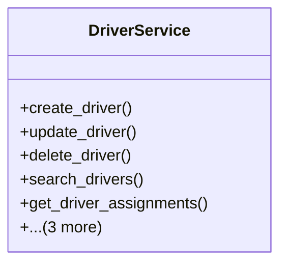

# services_modules.fleet_management.services.driver_service

## Imports
- django.db
- django.db.models
- django.utils
- models

## Classes
- DriverService
  - method: `create_driver`
  - method: `update_driver`
  - method: `delete_driver`
  - method: `search_drivers`
  - method: `get_driver_assignments`
  - method: `get_drivers_with_expiring_licenses`
  - method: `deactivate_driver`
  - method: `activate_driver`

## Functions
- create_driver
- update_driver
- delete_driver
- search_drivers
- get_driver_assignments
- get_drivers_with_expiring_licenses
- deactivate_driver
- activate_driver

## Class Diagram

