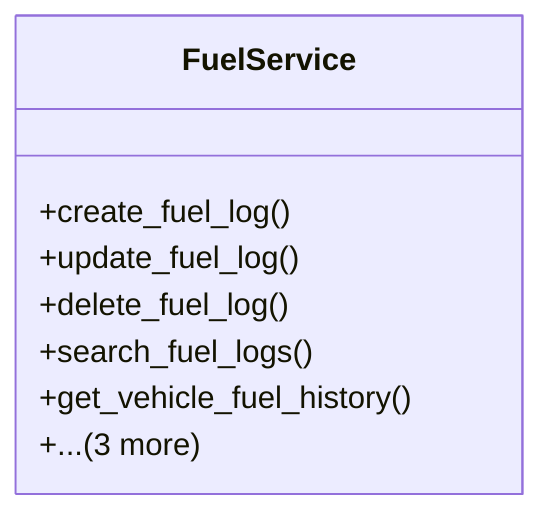

# services_modules.fleet_management.services.fuel_service

## Imports
- django.db
- django.db.models
- models

## Classes
- FuelService
  - method: `create_fuel_log`
  - method: `update_fuel_log`
  - method: `delete_fuel_log`
  - method: `search_fuel_logs`
  - method: `get_vehicle_fuel_history`
  - method: `get_vehicle_fuel_cost`
  - method: `calculate_fuel_efficiency`
  - method: `get_fleet_fuel_statistics`

## Functions
- create_fuel_log
- update_fuel_log
- delete_fuel_log
- search_fuel_logs
- get_vehicle_fuel_history
- get_vehicle_fuel_cost
- calculate_fuel_efficiency
- get_fleet_fuel_statistics

## Class Diagram

