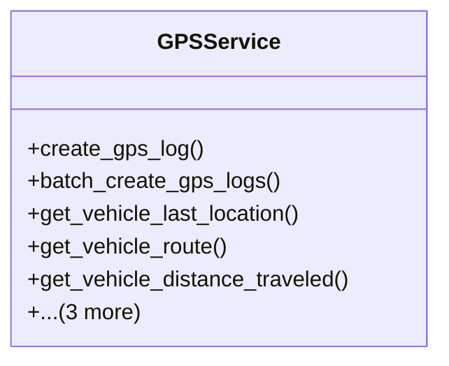

# services_modules.fleet_management.services.gps_service

## Imports
- datetime
- django.db
- django.db.models
- django.utils
- models

## Classes
- GPSService
  - method: `create_gps_log`
  - method: `batch_create_gps_logs`
  - method: `get_vehicle_last_location`
  - method: `get_vehicle_route`
  - method: `get_vehicle_distance_traveled`
  - method: `get_vehicles_in_area`
  - method: `get_vehicle_idle_time`
  - method: `clean_old_gps_logs`

## Functions
- create_gps_log
- batch_create_gps_logs
- get_vehicle_last_location
- get_vehicle_route
- get_vehicle_distance_traveled
- get_vehicles_in_area
- get_vehicle_idle_time
- clean_old_gps_logs

## Class Diagram

