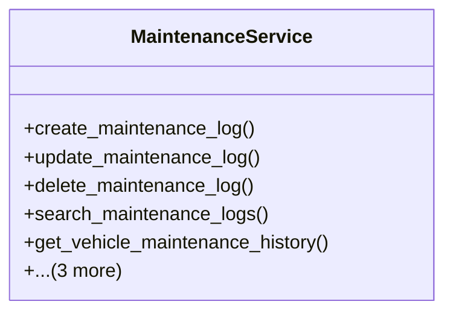

# services_modules.fleet_management.services.maintenance_service

## Imports
- django.db
- django.db.models
- django.utils
- models

## Classes
- MaintenanceService
  - method: `create_maintenance_log`
  - method: `update_maintenance_log`
  - method: `delete_maintenance_log`
  - method: `search_maintenance_logs`
  - method: `get_vehicle_maintenance_history`
  - method: `get_vehicle_maintenance_cost`
  - method: `complete_maintenance`
  - method: `get_upcoming_maintenance`

## Functions
- create_maintenance_log
- update_maintenance_log
- delete_maintenance_log
- search_maintenance_logs
- get_vehicle_maintenance_history
- get_vehicle_maintenance_cost
- complete_maintenance
- get_upcoming_maintenance

## Class Diagram

