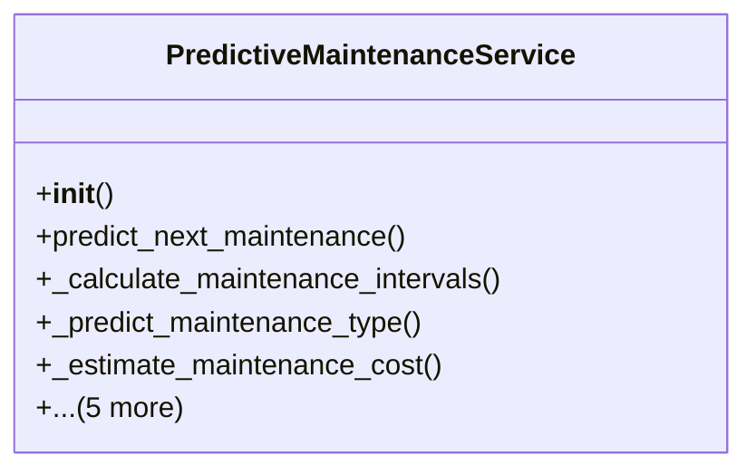

# services_modules.fleet_management.services.predictive_maintenance_service

## Imports
- datetime
- django.db.models
- django.utils
- logging
- models
- numpy

## Classes
- PredictiveMaintenanceService
  - method: `__init__`
  - method: `predict_next_maintenance`
  - method: `_calculate_maintenance_intervals`
  - method: `_predict_maintenance_type`
  - method: `_estimate_maintenance_cost`
  - method: `_calculate_prediction_confidence`
  - method: `analyze_fleet_maintenance_patterns`
  - method: `identify_maintenance_anomalies`
  - method: `generate_maintenance_recommendations`
  - method: `_analyze_fuel_efficiency`

## Functions
- __init__
- predict_next_maintenance
- _calculate_maintenance_intervals
- _predict_maintenance_type
- _estimate_maintenance_cost
- _calculate_prediction_confidence
- analyze_fleet_maintenance_patterns
- identify_maintenance_anomalies
- generate_maintenance_recommendations
- _analyze_fuel_efficiency

## Module Variables
- `logger`

## Class Diagram

