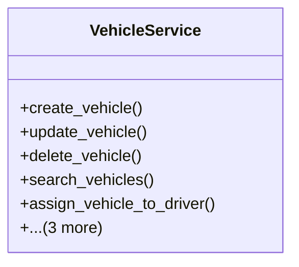

# services_modules.fleet_management.services.vehicle_service

## Imports
- django.db
- django.db.models
- django.utils
- models

## Classes
- VehicleService
  - method: `create_vehicle`
  - method: `update_vehicle`
  - method: `delete_vehicle`
  - method: `search_vehicles`
  - method: `assign_vehicle_to_driver`
  - method: `get_vehicle_current_driver`
  - method: `get_driver_current_vehicle`
  - method: `update_vehicle_status`

## Functions
- create_vehicle
- update_vehicle
- delete_vehicle
- search_vehicles
- assign_vehicle_to_driver
- get_vehicle_current_driver
- get_driver_current_vehicle
- update_vehicle_status

## Class Diagram

