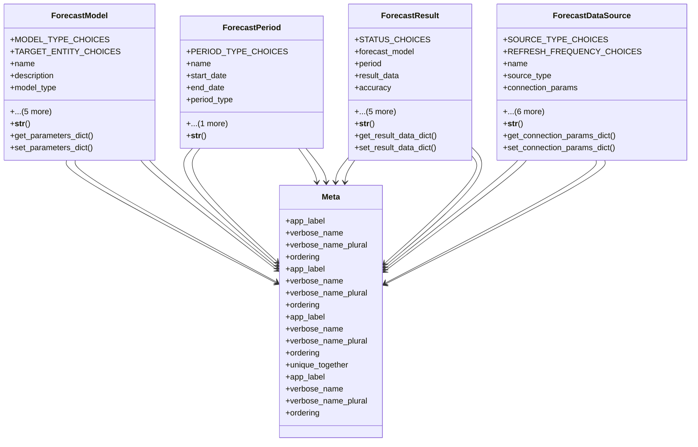

# services_modules.forecast.models

## Imports
- django.contrib.auth
- django.db
- django.utils.translation
- json

## Classes
- ForecastModel
  - attr: `MODEL_TYPE_CHOICES`
  - attr: `TARGET_ENTITY_CHOICES`
  - attr: `name`
  - attr: `description`
  - attr: `model_type`
  - attr: `parameters`
  - attr: `target_entity`
  - attr: `created_by`
  - attr: `created_at`
  - attr: `updated_at`
  - method: `__str__`
  - method: `get_parameters_dict`
  - method: `set_parameters_dict`
- ForecastPeriod
  - attr: `PERIOD_TYPE_CHOICES`
  - attr: `name`
  - attr: `start_date`
  - attr: `end_date`
  - attr: `period_type`
  - attr: `description`
  - method: `__str__`
- ForecastResult
  - attr: `STATUS_CHOICES`
  - attr: `forecast_model`
  - attr: `period`
  - attr: `result_data`
  - attr: `accuracy`
  - attr: `status`
  - attr: `notes`
  - attr: `created_by`
  - attr: `created_at`
  - attr: `updated_at`
  - method: `__str__`
  - method: `get_result_data_dict`
  - method: `set_result_data_dict`
- ForecastDataSource
  - attr: `SOURCE_TYPE_CHOICES`
  - attr: `REFRESH_FREQUENCY_CHOICES`
  - attr: `name`
  - attr: `source_type`
  - attr: `connection_params`
  - attr: `is_active`
  - attr: `refresh_frequency`
  - attr: `last_refresh`
  - attr: `created_by`
  - attr: `created_at`
  - attr: `updated_at`
  - method: `__str__`
  - method: `get_connection_params_dict`
  - method: `set_connection_params_dict`
- Meta
  - attr: `app_label`
  - attr: `verbose_name`
  - attr: `verbose_name_plural`
  - attr: `ordering`
- Meta
  - attr: `app_label`
  - attr: `verbose_name`
  - attr: `verbose_name_plural`
  - attr: `ordering`
- Meta
  - attr: `app_label`
  - attr: `verbose_name`
  - attr: `verbose_name_plural`
  - attr: `ordering`
  - attr: `unique_together`
- Meta
  - attr: `app_label`
  - attr: `verbose_name`
  - attr: `verbose_name_plural`
  - attr: `ordering`

## Functions
- __str__
- get_parameters_dict
- set_parameters_dict
- __str__
- __str__
- get_result_data_dict
- set_result_data_dict
- __str__
- get_connection_params_dict
- set_connection_params_dict

## Module Variables
- `User`

## Class Diagram

