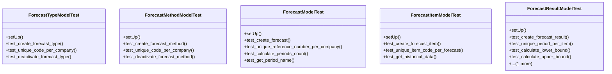

# services_modules.forecast.tests.test_forecast

## Imports
- datetime
- decimal
- django.core.exceptions
- django.db
- django.test
- django.utils
- models.forecast
- models.forecast_item
- models.forecast_result
- services_modules.core.models

## Classes
- ForecastTypeModelTest
  - method: `setUp`
  - method: `test_create_forecast_type`
  - method: `test_unique_code_per_company`
  - method: `test_deactivate_forecast_type`
- ForecastMethodModelTest
  - method: `setUp`
  - method: `test_create_forecast_method`
  - method: `test_unique_code_per_company`
  - method: `test_deactivate_forecast_method`
- ForecastModelTest
  - method: `setUp`
  - method: `test_create_forecast`
  - method: `test_unique_reference_number_per_company`
  - method: `test_calculate_periods_count`
  - method: `test_get_period_name`
- ForecastItemModelTest
  - method: `setUp`
  - method: `test_create_forecast_item`
  - method: `test_unique_item_code_per_forecast`
  - method: `test_get_historical_data`
- ForecastResultModelTest
  - method: `setUp`
  - method: `test_create_forecast_result`
  - method: `test_unique_period_per_item`
  - method: `test_calculate_lower_bound`
  - method: `test_calculate_upper_bound`
  - method: `test_calculate_error_metrics`

## Functions
- setUp
- test_create_forecast_type
- test_unique_code_per_company
- test_deactivate_forecast_type
- setUp
- test_create_forecast_method
- test_unique_code_per_company
- test_deactivate_forecast_method
- setUp
- test_create_forecast
- test_unique_reference_number_per_company
- test_calculate_periods_count
- test_get_period_name
- setUp
- test_create_forecast_item
- test_unique_item_code_per_forecast
- test_get_historical_data
- setUp
- test_create_forecast_result
- test_unique_period_per_item
- test_calculate_lower_bound
- test_calculate_upper_bound
- test_calculate_error_metrics
- mock_calculate_periods_count
- mock_get_period_name
- mock_get_historical_data
- mock_calculate_lower_bound
- mock_calculate_upper_bound
- mock_calculate_error_metrics

## Class Diagram

