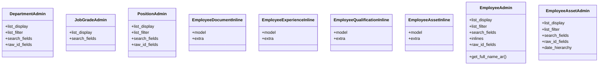

# services_modules.hr.admin

## Imports
- django.contrib
- django.utils.translation
- models

## Classes
- DepartmentAdmin
  - attr: `list_display`
  - attr: `list_filter`
  - attr: `search_fields`
  - attr: `raw_id_fields`
- JobGradeAdmin
  - attr: `list_display`
  - attr: `search_fields`
- PositionAdmin
  - attr: `list_display`
  - attr: `list_filter`
  - attr: `search_fields`
  - attr: `raw_id_fields`
- EmployeeDocumentInline
  - attr: `model`
  - attr: `extra`
- EmployeeExperienceInline
  - attr: `model`
  - attr: `extra`
- EmployeeQualificationInline
  - attr: `model`
  - attr: `extra`
- EmployeeAssetInline
  - attr: `model`
  - attr: `extra`
- EmployeeAdmin
  - attr: `list_display`
  - attr: `list_filter`
  - attr: `search_fields`
  - attr: `inlines`
  - attr: `raw_id_fields`
  - method: `get_full_name_ar`
- EmployeeAssetAdmin
  - attr: `list_display`
  - attr: `list_filter`
  - attr: `search_fields`
  - attr: `raw_id_fields`
  - attr: `date_hierarchy`

## Functions
- get_full_name_ar

## Class Diagram

