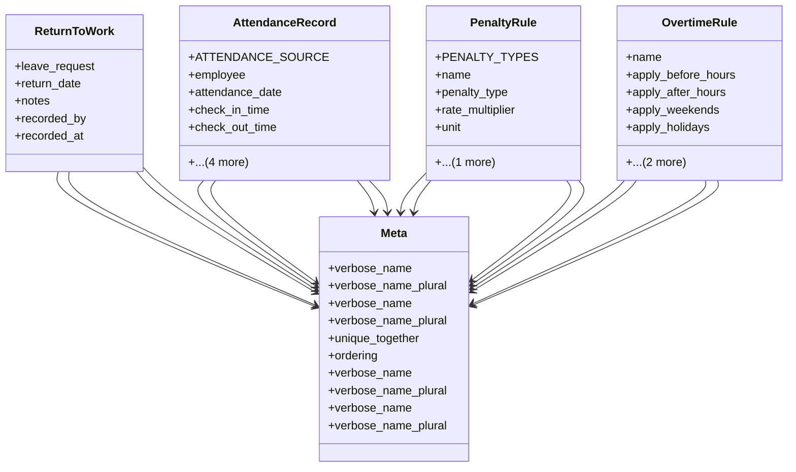

# services_modules.hr.attendance

## Imports
- django.conf
- django.db
- django.utils.translation
- employee
- leave

## Classes
- ReturnToWork
  - attr: `leave_request`
  - attr: `return_date`
  - attr: `notes`
  - attr: `recorded_by`
  - attr: `recorded_at`
- AttendanceRecord
  - attr: `ATTENDANCE_SOURCE`
  - attr: `employee`
  - attr: `attendance_date`
  - attr: `check_in_time`
  - attr: `check_out_time`
  - attr: `source`
  - attr: `latitude`
  - attr: `longitude`
  - attr: `notes`
- PenaltyRule
  - attr: `PENALTY_TYPES`
  - attr: `name`
  - attr: `penalty_type`
  - attr: `rate_multiplier`
  - attr: `unit`
  - attr: `is_active`
- OvertimeRule
  - attr: `name`
  - attr: `apply_before_hours`
  - attr: `apply_after_hours`
  - attr: `apply_weekends`
  - attr: `apply_holidays`
  - attr: `rate_multiplier`
  - attr: `is_active`
- Meta
  - attr: `verbose_name`
  - attr: `verbose_name_plural`
- Meta
  - attr: `verbose_name`
  - attr: `verbose_name_plural`
  - attr: `unique_together`
  - attr: `ordering`
- Meta
  - attr: `verbose_name`
  - attr: `verbose_name_plural`
- Meta
  - attr: `verbose_name`
  - attr: `verbose_name_plural`

## Class Diagram

