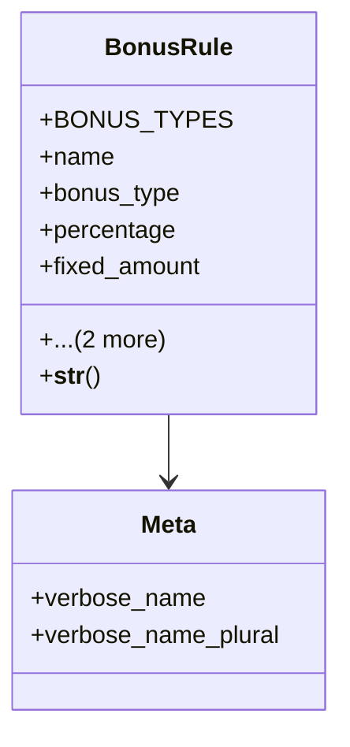

# services_modules.hr.bonuses

## Imports
- django.conf
- django.db
- django.utils.translation

## Classes
- BonusRule
  - attr: `BONUS_TYPES`
  - attr: `name`
  - attr: `bonus_type`
  - attr: `percentage`
  - attr: `fixed_amount`
  - attr: `applicable_year`
  - attr: `is_active`
  - method: `__str__`
- Meta
  - attr: `verbose_name`
  - attr: `verbose_name_plural`

## Functions
- __str__

## Class Diagram

