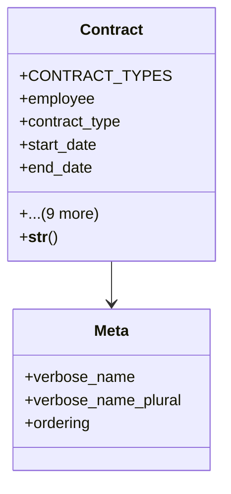

# services_modules.hr.contracts

## Imports
- core_modules.organization.models
- django.conf
- django.db
- django.utils.translation
- employee
- structure
- time

## Classes
- Contract
  - attr: `CONTRACT_TYPES`
  - attr: `employee`
  - attr: `contract_type`
  - attr: `start_date`
  - attr: `end_date`
  - attr: `position`
  - attr: `salary`
  - attr: `salary_currency`
  - attr: `working_hours_per_week`
  - attr: `probation_period_months`
  - attr: `is_active`
  - attr: `contract_file`
  - attr: `created_at`
  - attr: `updated_at`
  - method: `__str__`
- Meta
  - attr: `verbose_name`
  - attr: `verbose_name_plural`
  - attr: `ordering`

## Functions
- __str__

## Class Diagram

