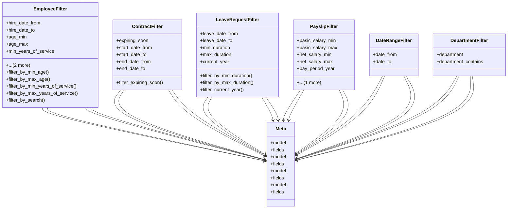

# services_modules.hr.filters

## Imports
- datetime
- django.db
- django.utils
- django_filters
- models

## Classes
- EmployeeFilter
  - attr: `hire_date_from`
  - attr: `hire_date_to`
  - attr: `age_min`
  - attr: `age_max`
  - attr: `min_years_of_service`
  - attr: `max_years_of_service`
  - attr: `search`
  - method: `filter_by_min_age`
  - method: `filter_by_max_age`
  - method: `filter_by_min_years_of_service`
  - method: `filter_by_max_years_of_service`
  - method: `filter_by_search`
- ContractFilter
  - attr: `expiring_soon`
  - attr: `start_date_from`
  - attr: `start_date_to`
  - attr: `end_date_from`
  - attr: `end_date_to`
  - method: `filter_expiring_soon`
- LeaveRequestFilter
  - attr: `leave_date_from`
  - attr: `leave_date_to`
  - attr: `min_duration`
  - attr: `max_duration`
  - attr: `current_year`
  - method: `filter_by_min_duration`
  - method: `filter_by_max_duration`
  - method: `filter_current_year`
- PayslipFilter
  - attr: `basic_salary_min`
  - attr: `basic_salary_max`
  - attr: `net_salary_min`
  - attr: `net_salary_max`
  - attr: `pay_period_year`
  - attr: `pay_period_month`
- DateRangeFilter
  - attr: `date_from`
  - attr: `date_to`
- DepartmentFilter
  - attr: `department`
  - attr: `department_contains`
- Meta
  - attr: `model`
  - attr: `fields`
- Meta
  - attr: `model`
  - attr: `fields`
- Meta
  - attr: `model`
  - attr: `fields`
- Meta
  - attr: `model`
  - attr: `fields`

## Functions
- filter_by_min_age
- filter_by_max_age
- filter_by_min_years_of_service
- filter_by_max_years_of_service
- filter_by_search
- filter_expiring_soon
- filter_by_min_duration
- filter_by_max_duration
- filter_current_year

## Class Diagram

