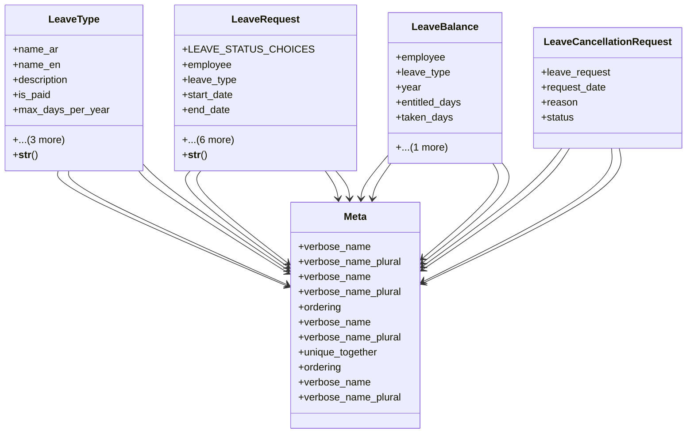

# services_modules.hr.leave

## Imports
- django.conf
- django.db
- django.utils.translation
- employee

## Classes
- LeaveType
  - attr: `name_ar`
  - attr: `name_en`
  - attr: `description`
  - attr: `is_paid`
  - attr: `max_days_per_year`
  - attr: `is_active`
  - attr: `created_at`
  - attr: `updated_at`
  - method: `__str__`
- LeaveRequest
  - attr: `LEAVE_STATUS_CHOICES`
  - attr: `employee`
  - attr: `leave_type`
  - attr: `start_date`
  - attr: `end_date`
  - attr: `reason`
  - attr: `status`
  - attr: `replacement_employee`
  - attr: `requested_at`
  - attr: `current_approver`
  - attr: `rejection_reason`
  - method: `__str__`
- LeaveBalance
  - attr: `employee`
  - attr: `leave_type`
  - attr: `year`
  - attr: `entitled_days`
  - attr: `taken_days`
  - attr: `balance_days`
- LeaveCancellationRequest
  - attr: `leave_request`
  - attr: `request_date`
  - attr: `reason`
  - attr: `status`
- Meta
  - attr: `verbose_name`
  - attr: `verbose_name_plural`
- Meta
  - attr: `verbose_name`
  - attr: `verbose_name_plural`
  - attr: `ordering`
- Meta
  - attr: `verbose_name`
  - attr: `verbose_name_plural`
  - attr: `unique_together`
  - attr: `ordering`
- Meta
  - attr: `verbose_name`
  - attr: `verbose_name_plural`

## Functions
- __str__
- __str__

## Class Diagram

