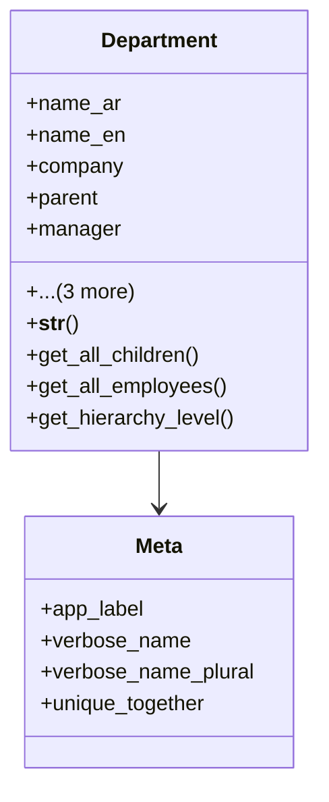

# services_modules.hr.models.department

## Imports
- django.db
- django.db.models
- django.utils.translation
- employee

## Classes
- Department
  - attr: `name_ar`
  - attr: `name_en`
  - attr: `company`
  - attr: `parent`
  - attr: `manager`
  - attr: `is_active`
  - attr: `created_at`
  - attr: `updated_at`
  - method: `__str__`
  - method: `get_all_children`
  - method: `get_all_employees`
  - method: `get_hierarchy_level`
- Meta
  - attr: `app_label`
  - attr: `verbose_name`
  - attr: `verbose_name_plural`
  - attr: `unique_together`

## Functions
- __str__
- get_all_children
- get_all_employees
- get_hierarchy_level

## Class Diagram

