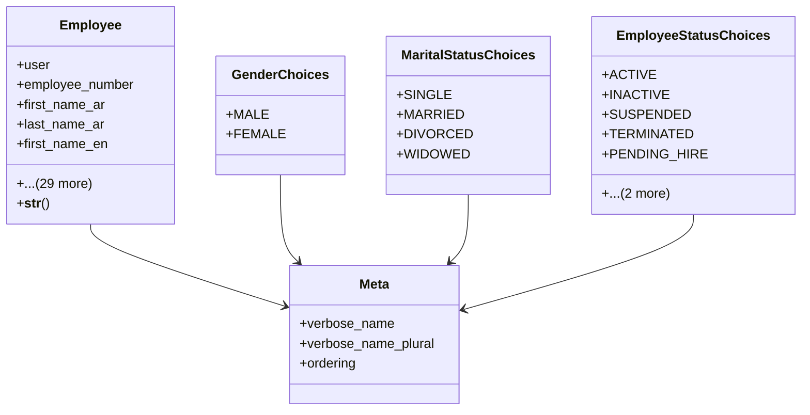

# services_modules.hr.models.employee

## Imports
- django.conf
- django.db
- django.utils.translation

## Classes
- Employee
  - attr: `user`
  - attr: `employee_number`
  - attr: `first_name_ar`
  - attr: `last_name_ar`
  - attr: `first_name_en`
  - attr: `last_name_en`
  - attr: `gender`
  - attr: `date_of_birth`
  - attr: `nationality`
  - attr: `national_id`
  - attr: `marital_status`
  - attr: `photo`
  - attr: `personal_email`
  - attr: `mobile_phone`
  - attr: `work_email`
  - attr: `work_phone`
  - attr: `company_mobile`
  - attr: `address`
  - attr: `hire_date`
  - attr: `termination_date`
  - attr: `branch`
  - attr: `department`
  - attr: `position`
  - attr: `manager`
  - attr: `status`
  - attr: `emergency_contact_name`
  - attr: `emergency_contact_relation`
  - attr: `emergency_contact_phone`
  - attr: `bank_name`
  - attr: `bank_account_number`
  - attr: `bank_iban`
  - attr: `company_car_details`
  - attr: `created_at`
  - attr: `updated_at`
  - method: `__str__`
- GenderChoices
  - attr: `MALE`
  - attr: `FEMALE`
- MaritalStatusChoices
  - attr: `SINGLE`
  - attr: `MARRIED`
  - attr: `DIVORCED`
  - attr: `WIDOWED`
- EmployeeStatusChoices
  - attr: `ACTIVE`
  - attr: `INACTIVE`
  - attr: `SUSPENDED`
  - attr: `TERMINATED`
  - attr: `PENDING_HIRE`
  - attr: `BLACKLISTED`
  - attr: `ON_LEAVE`
- Meta
  - attr: `verbose_name`
  - attr: `verbose_name_plural`
  - attr: `ordering`

## Functions
- __str__

## Class Diagram

